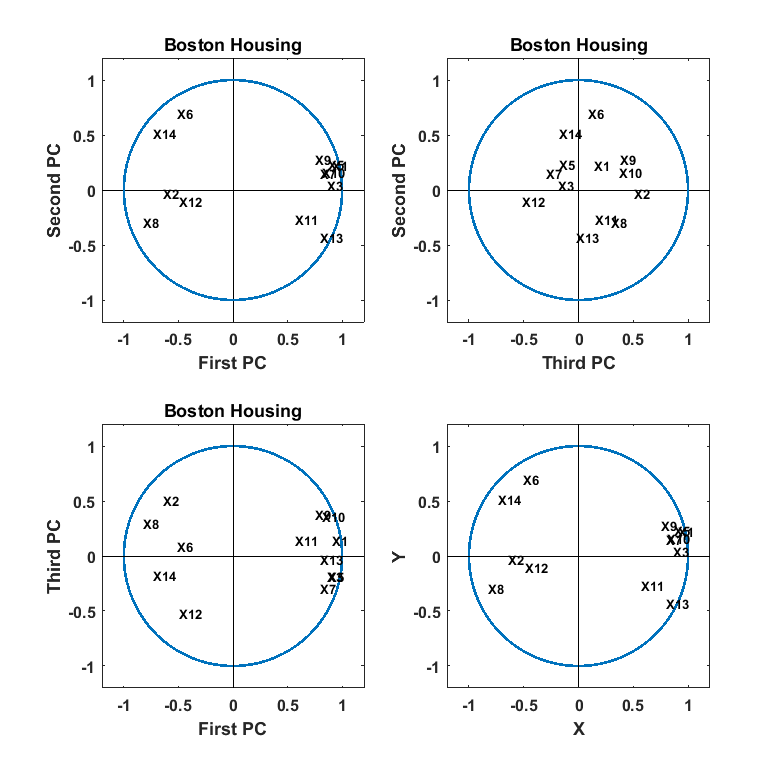
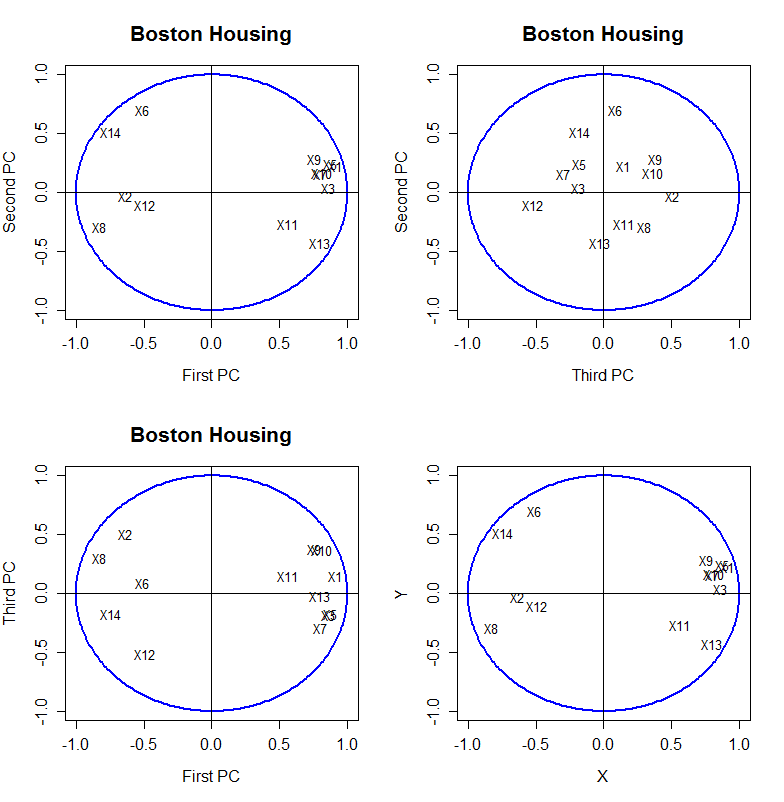

[](http://quantlet.de/)

## [](http://quantlet.de/) **MVAnpcahousi** [](http://quantlet.de/)

```yaml

Name of QuantLet: MVAnpcahousi

Published in: Applied Multivariate Statistical Analysis

Description: Calculates and plots the correlations of the first three PCs with the original variables for the standardized Boston housing data.

Keywords: principal-components, pca, npca, eigenvalues, standardization, spectral-decomposition, correlation, plot, graphical representation, data visualization, sas

See also: MVAnpcabanki, MVAnpcabank, MVAnpcahous, MVAnpcatime, MVAnpcafood, MVAnpcausco, MVAnpcausco2, MVAnpcausco2i, MVAcpcaiv, MVApcabank, MVApcabanki, MVApcabankr, MVApcasimu

Author: Zografia Anastasiadou
Author[SAS]: Svetlana Bykovskaya
Author[Matlab]: Wolfgang Haerdle, Vladimir Georgescu, Jorge Patron, Song Song

Submitted: Mon, December 12 2016 by Piedad Castro
Submitted[SAS]: Wed, April 06 2016 by Svetlana Bykovskaya
Submitted[Matlab]: Wed, December 14 2016 by Piedad Castro

Datafile: bostonh.dat

Note: 'Matlab and SAS decompose matrices differently than R, and therefore some 
      of the eigenvectors may have different signs.'

```






### MATLAB Code
```matlab

%% clear all variables and console and close windows
clear
clc
close all

%% load data
data = load('bostonh.dat');

%% Transformations
xt       = data;
xt(:, 1)  = log(data(:, 1));
xt(:, 2)  = data(:, 2)/10;
xt(:, 3)  = log(data(:, 3));
xt(:, 5)  = log(data(:, 5));
xt(:, 6)  = log(data(:, 6));
xt(:, 7)  = (power(data(:, 7), 2.5))/10000;
xt(:, 8)  = log(data(:, 8));
xt(:, 9)  = log(data(:, 9));
xt(:, 10) = log(data(:, 10));
xt(:, 11) = exp(0.4 * data(:, 11))/1000;
xt(:, 12) = data(:, 12)/100;
xt(:, 13) = sqrt(data(:, 13));
xt(:, 14) = log(data(:, 14));

data       = xt;
data(:, 4) = [];
n1         = length(data);
m          = mean(data);
b          = sqrt((n1-1) * var(data)/n1);
x          = (data - repmat(m,n1,1))./repmat(b,n1,1);
adjust     = (n1 - 1) * cov(x)/n1;
[v, e]     = eigs(adjust, 13, 'la');

% change the sign of the eigenvectors . This is done only to make easier
% the comparison with R results.
v(:, [1 2 4 7 8 ]) = -v(:, [1 2 4 7 8 ]);

m  = mean(x);
x1 = x - repmat(m,n1,1);
r1 = x1 * v;
r  = corr([r1 x]);


%% correlations between variables and the first three pc's
r123 = r(14:end, 1:3);

%% plots
% First and Second PC
subplot(2, 2, 1)
hold on
xlim([-1.2 1.2])
ylim([-1.2 1.2])
line([-1.2 1.2], [0 0], 'Color', 'k')
line([0 0], [1.2 -1.2], 'Color', 'k')
title('Boston Housing', 'FontSize', 12, 'FontWeight', 'bold')
xlabel('First PC', 'FontSize', 12, 'FontWeight', 'bold')
ylabel('Second PC', 'FontSize', 12, 'FontWeight', 'bold')
set(gca, 'FontSize', 12, 'FontWeight', 'bold', 'Box', 'on')
circle = rsmak('circle');
fnplt(circle)
for i=1:length(r123)
    if i<4
        text(r123(i, 1), r123(i, 2), strcat('X', int2str(i)), 'FontSize', 10, 'FontWeight', 'bold')
    else
        text(r123(i, 1), r123(i, 2), strcat('X', int2str(i + 1)), 'FontSize', 10, 'FontWeight', 'bold')
    end
end

% Third and Second PC
subplot(2, 2, 2)
hold on
xlim([-1.2 1.2])
ylim([-1.2 1.2])
line([-1.2 1.2], [0 0], 'Color', 'k')
line([0 0], [1.2 -1.2], 'Color', 'k')
title('Boston Housing', 'FontSize', 12, 'FontWeight', 'bold')
xlabel('Third PC', 'FontSize', 12, 'FontWeight', 'bold')
ylabel('Second PC', 'FontSize', 12, 'FontWeight', 'bold')
set(gca, 'FontSize', 12, 'FontWeight', 'bold', 'Box', 'on')
circle = rsmak('circle');
fnplt(circle)
for i=1:length(r123)
    if i<4
        text(r123(i, 3), r123(i, 2), strcat('X', int2str(i)), 'FontSize', 10, 'FontWeight', 'bold')
    else
        text(r123(i, 1), r123(i, 2), strcat('X', int2str(i + 1)),'FontSize', 10, 'FontWeight', 'bold')
    end
end

% First and Third PC
subplot(2, 2, 3)
circle = rsmak('circle');
fnplt(circle)
xlim([-1.2 1.2])
ylim([-1.2 1.2])
line([-1.2 1.2], [0 0], 'Color', 'k')
line([0 0], [1.2 -1.2], 'Color', 'k')
title('Boston Housing', 'FontSize', 12, 'FontWeight', 'bold')
xlabel('First PC', 'FontSize', 12, 'FontWeight', 'bold')
ylabel('Third PC', 'FontSize', 12, 'FontWeight', 'bold')
set(gca, 'FontSize', 12, 'FontWeight', 'bold', 'Box', 'on')
for i=1:length(r123)
    if i<4
        text(r123(i, 1), r123(i, 3), strcat('X', int2str(i)), 'FontSize', 10, 'FontWeight', 'bold')   
    else
        text(r123(i, 1), r123(i, 3), strcat('X', int2str(i + 1)), 'FontSize',  10, 'FontWeight', 'bold')
    end
end

disp('Correlations of the first three PCs with the original variables')
disp('      PC1       PC2       PC3')
disp(r123)

```

automatically created on 2018-05-28

### R Code
```r


# clear all variables
rm(list = ls(all = TRUE))
graphics.off()

# load data
data = read.table("bostonh.dat")

# transform data
xt       = data
xt[, 1]  = log(data[, 1])
xt[, 2]  = data[, 2]/10
xt[, 3]  = log(data[, 3])
xt[, 5]  = log(data[, 5])
xt[, 6]  = log(data[, 6])
xt[, 7]  = (data[, 7]^(2.5))/10000
xt[, 8]  = log(data[, 8])
xt[, 9]  = log(data[, 9])
xt[, 10] = log(data[, 10])
xt[, 11] = exp(0.4 * data[, 11])/1000
xt[, 12] = data[, 12]/100
xt[, 13] = sqrt(data[, 13])
xt[, 14] = log(as.numeric(data[, 14]))
data     = xt[, -4] 
 
n1  = nrow(data)
n2  = ncol(data)
x   = (data - matrix(apply(data,2,mean), n1, n2, byrow = T))/matrix(sqrt((n1 - 1) * 
       apply(data, 2, var)/n1), n1, n2, byrow = T)  # standardizes the data
eig = eigen((n1 - 1) * cov(x)/n1)  # spectral decomposition
e   = eig$values
v   = eig$vectors
x1  = as.matrix(x - matrix(apply(x,2,mean), n1, n2, byrow = T))
r1  = x1 %*% v
r   = cor(cbind(r1, x))

# correlations between variables and the first three pc's
r123 = r[14:26, 1:3]

# plot
par(mfrow = c(2, 2))
ucircle = cbind(cos((0:360)/180 * pi), sin((0:360)/180 * pi))
plot(ucircle, type = "l", lty = "solid", col = "blue", xlab = "First PC", ylab = "Second PC", 
    main = "Boston Housing", cex.lab = 1.2, cex.axis = 1.2, cex.main = 1.6, lwd = 2)
abline(h = 0, v = 0)
label = c("X1", "X2", "X3", "X5", "X6", "X7", "X8", "X9", "X10", "X11", "X12", "X13", 
    "X14")
text(r123[,c(1,2)], label)

ucircle = cbind(cos((0:360)/180 * pi), sin((0:360)/180 * pi))
plot(ucircle, type = "l", lty = "solid", col = "blue", xlab = "Third PC", ylab = "Second PC", 
    main = "Boston Housing", cex.lab = 1.2, cex.axis = 1.2, cex.main = 1.6, lwd = 2)
abline(h = 0, v = 0)
label = c("X1", "X2", "X3", "X5", "X6", "X7", "X8", "X9", "X10", "X11", "X12", "X13", 
    "X14")
text(r123[,c(3,2)], label)

ucircle = cbind(cos((0:360)/180 * pi), sin((0:360)/180 * pi))
plot(ucircle, type = "l", lty = "solid", col = "blue", xlab = "First PC", ylab = "Third PC", 
    main = "Boston Housing", cex.lab = 1.2, cex.axis = 1.2, cex.main = 1.6, lwd = 2)
abline(h = 0, v = 0)
label = c("X1", "X2", "X3", "X5", "X6", "X7", "X8", "X9", "X10", "X11", "X12", "X13", 
    "X14")
text(r123[,c(1,3)], label)

```

automatically created on 2018-05-28

### SAS Code
```sas

* Import the data;
data bostonh;
  infile '/folders/myfolders/data/bostonh.dat';
  input temp1-temp14;
run;

proc iml;
  * Read data into a matrix;
  use bostonh;
    read all var _ALL_ into datax; 
  close bostonh;
  
  xt = datax;
  xt[, 1]  = log(datax[, 1]);
  xt[, 2]  = datax[, 2]/10;
  xt[, 3]  = log(datax[, 3]);
  xt[, 5]  = log(datax[, 5]);
  xt[, 6]  = log(datax[, 6]);
  xt[, 7]  = (datax[, 7] ## (2.5))/10000;
  xt[, 8]  = log(datax[, 8]);
  xt[, 9]  = log(datax[, 9]);
  xt[, 10] = log(datax[, 10]);
  xt[, 11] = exp(0.4 * datax[, 11])/1000;
  xt[, 12] = datax[, 12]/100;
  xt[, 13] = sqrt(datax[, 13]);
  xt[, 14] = log(datax[, 14]);
  datax = xt[,1:3] || xt[,5:14];
  
  n1  = nrow(datax);
  n2  = ncol(datax);
  x   = (datax - repeat(datax[:], n1, n2)) / sqrt((n1 - 1) * var(datax) / n1); * standardizes the data;
  eig = (n1 - 1) * cov(x)/n1; * spectral decomposition;
  e   = eigval(eig);
  v   = eigvec(eig);
  x1  = x - repeat(x[:], nrow(x), ncol(x));
  r1  = x1 * v;
  r   = corr(r1 || x);
  
  * correlations between variables and pc's;
  r12  = r[14:26, 1:2];
  r13  = r[14:26, 1] || r[14:26, 3];
  r32  = r[14:26, 3] || r[14:26, 2];
  r123 = r[14:26, 1:2];
  
  pi = constant("pi");
  uc = (cos((0:360)/180 * pi) // sin((0:360)/180 * pi))`;
  u1 = uc[,1];
  u2 = uc[,2];
  names = {"X1", "X2", "X3", "X5", "X6", "X7", 
    "X8", "X9", "X10", "X11", "X12", "X13", "X14"};
  
  x11  = -r12[,1];
  x12  = r12[,2]; 
  x21  = -r32[,1];
  x22  = r32[,2];
  x31  = -r13[,1];
  x32  = -r13[,2];
  x41  = -r123[,1];
  x42  = r123[,2]; 
   
  create plot var {"x11" "x12" "x21" "x22" "x31" "x32" "x41" "x42" "u1" "u2" "names"};
    append;
  close plot;
quit;
  
proc sgplot data = plot
    noautolegend;
  title 'Boston Housing';
  series  x = u1 y = u2 / lineattrs = (color = blue THICKNESS = 2);
  scatter x = x11 y = x12 / markerattrs = (color = black symbol = circlefilled)
    datalabel = names;
  refline 0 / lineattrs = (color = black);
  refline 0 / axis = x lineattrs = (color = black);
  xaxis label = 'First PC';
  yaxis label = 'Second PC';
run;

proc sgplot data = plot
    noautolegend;
  title 'Boston Housing';
  series  x = u1 y = u2 / lineattrs = (color = blue THICKNESS = 2);
  scatter x = x21 y = x22 / markerattrs = (color = black symbol = circlefilled)
    datalabel = names;
  refline 0 / lineattrs = (color = black);
  refline 0 / axis = x lineattrs = (color = black);
  xaxis label = 'Third PC';
  yaxis label = 'Second PC';
run;
  
proc sgplot data = plot
    noautolegend;
  title 'Boston Housing';
  series  x = u1 y = u2 / lineattrs = (color = blue THICKNESS = 2);
  scatter x = x31 y = x32 / markerattrs = (color = black symbol = circlefilled)
    datalabel = names;
  refline 0 / lineattrs = (color = black);
  refline 0 / axis = x lineattrs = (color = black);
  xaxis label = 'First PC';
  yaxis label = 'Third PC';
run;

proc sgplot data = plot
    noautolegend;
  title 'Boston Housing';
  series  x = u1 y = u2 / lineattrs = (color = blue THICKNESS = 2);
  scatter x = x41 y = x42 / markerattrs = (color = black symbol = circlefilled)
    datalabel = names;
  refline 0 / lineattrs = (color = black);
  refline 0 / axis = x lineattrs = (color = black);
  xaxis label = 'X';
  yaxis label = 'Y';
run;
  
```

automatically created on 2018-05-28