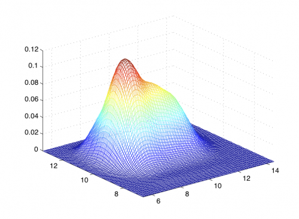
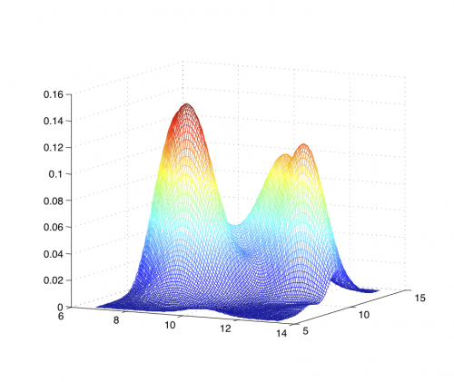

[](http://quantlet.de/)

## [](http://quantlet.de/) **MVAdenbank3** [](http://quantlet.de/)

```yaml


Name of QuantLet: MVAdenbank3

Published in: Applied Multivariate Statistical Analysis

Description: 'Gives plots of the product of univariate and joint kernel density estimates of variables X4 and X5 of the Swiss bank notes.'

Keywords: 3D, data visualization, plot, graphical representation, financial, density, descriptive, descriptive-statistics, empirical, gaussian, kde, kernel, smoothing, univariate, visualization, joint distribution

See also: MVAdenbank, MVAdenbank2, MVAdraftbank4, MVAscabank45, MVAscabank456, SPMdenepatri, SPMkdeconstruct, SPMkernel

Author: Song Song

Submitted: Tue, September 09 2014 by Awdesch Melzer

Datafiles: bank2.dat

Example: 
- 1: Joint density estimate for X4 and X5 of the bank notes.
- 2: The product of univariate density estimates for X4 and X5 of the bank notes.

```






### R Code
```r


# clear variables and close windows
rm(list = ls(all = TRUE))
graphics.off()

# install and load packages
libraries = c("KernSmooth", "graphics")
lapply(libraries, function(x) if (!(x %in% installed.packages())) {
install.packages(x)
})
lapply(libraries, library, quietly = TRUE, character.only = TRUE)

# load data
xx = read.table("bank2.dat")

# Compute a kernel density estimates
dj = bkde2D(xx[, 4:5], bandwidth = 1.06 * c(sd(xx[, 4]), sd(xx[, 5])) * 200^(-1/5))
d1 = bkde(xx[, 4], gridsize = 51)
d2 = bkde(xx[, 5], gridsize = 51)
dp = (d1$y) %*% t(d2$y)

# plot
persp(d1$x, d2$x, dp, box = FALSE, main = "Joint estimate")
persp(dj$x1, dj$x2, dj$fhat, box = FALSE, main = "Product of estimates")

```

automatically created on 2018-05-28

### MATLAB Code
```matlab


%% clear loaded variables and close windows
clear all;
close all;
clc;

format long;

%% load dataset
xx = load('bank2.dat');
h  = 1.06*[std(xx(:, 4)) std(xx(:, 5))].* 200.^(-1/5);

% Compute a kernel density estimates
[f1,xi1] = ksdensity(xx(:, 4));
[f2,xi2] = ksdensity(xx(:, 5));

%% plot
[xxi,yyi] = meshgrid(xi1,xi2);
[ff1,ff2] = meshgrid(f1,f2);
pdfxy     = ff1.*ff2;
figure(1)
mesh(xxi,yyi,pdfxy)
set(gca, 'XLim',[min(xi1) max(xi1)])
set(gca, 'YLim',[min(xi2) max(xi2)])


xrange = min(xx(:,4)):(max(xx(:,4))-min(xx(:,4)))./99:max(xx(:,4));
yrange = min(xx(:,5)):(max(xx(:,5))-min(xx(:,5)))./99:max(xx(:,5));

% steps
endx  = length(xrange);
endy  = length(yrange);
ndata = length(xx(:,4));

for xxxi = 1:endx
    for yyyi = 1:endy
        u1 =(xrange(xxxi)-xx(:,4))/h(1);
        u2 =(yrange(yyyi)-xx(:,5))/h(2);
        u  = [u1,u2]';
        for is = 1:ndata
            KD(is) = 1/(2*pi)^(2/2)*exp(-1/2*u(:,is)'*u(:,is));
        end
        fhat(xxxi,yyyi) = mean(KD)/prod(h);
    end
end
figure(2)
mesh(yyi,xxi,fhat)

```

automatically created on 2018-05-28