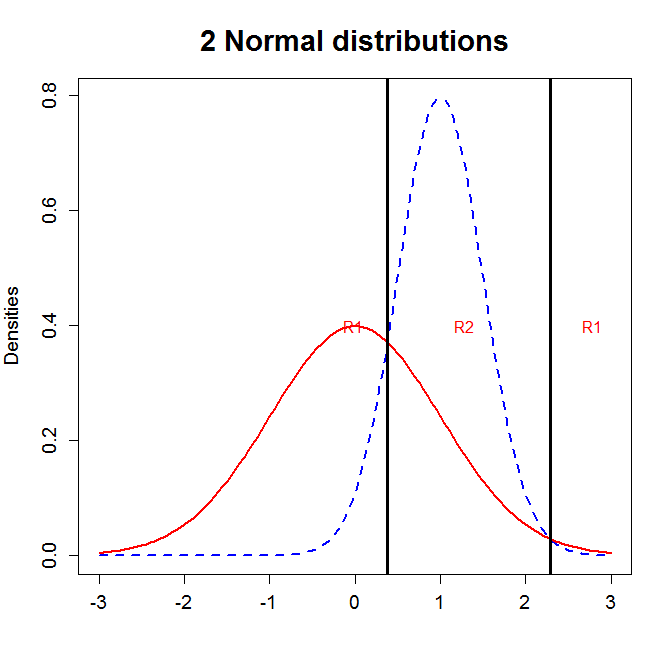

[](http://quantlet.de/)

## [](http://quantlet.de/) **MVAdisnorm** [](http://quantlet.de/)

```yaml

Name of QuantLet: MVAdisnorm

Published in: Applied Multivariate Statistical Analysis

Description: Displays graphically maximum likelihood discrimination rule (ML rule) for 2 normal distributed samples. The inner interval is the allocation set for N(1,0.25), the outer intervals are for observations from N(0,1).

Keywords: discrimination, estimation, discriminant-analysis, maximum-likelihood, normal, normal-distribution, plot, graphical representation

See also: MVAaer, MVAaper, MVAaerbh, MVAdisfbank, MVAdiscbh

Author: Zografia Anastasiadou, Awdesch Melzer
Author[Matlab]: Vladimir Georgescu, Jorge Patron, Song Song, Awdesch Melzer

Submitted: Fri, December 16 by Piedad Castro

Example: Maximum likelihood rule for 2 normal distributed samples.

```




### MATLAB Code
```matlab

%% clear all variables and console and close windows
clear
clc
close all

t = -3:0.05:3;

s1    = 1;
mu1   = 0;
pdfn1 = normpdf(t,mu1,s1);
f1    = [t',pdfn1'];

s2    = 0.5;
mu2   = 1;
pdfn2 = normpdf(t,mu2,s2);
f2    = [t',pdfn2'];

%% plot 
hold on
title('2 Normal Distributions');
ylabel('Densities');
plot(f1(:,1),f1(:,2),'r','LineWidth',2)
plot(f2(:,1),f2(:,2),'b','LineStyle','--','Linewidth',2)

% First and second discrimination points
if and(s1~=s2,mu1~=mu2)
    %first discrimination point
    c1 = -(mu2.*s1.^2-mu1.*s2.^2)./(s2.^2-s1.^2) + sqrt(((mu2.*s1.^2-mu1.*s2.^2)./(s2.^2-s1.^2)).^2-((mu1.^2.*s2.^2 - mu2.^2.*s1.^2 - 2.*log(s2./s1).*s1.^2.*s2.^2)./(s2.^2-s1.^2)));
    %second discrimination point
    c2 = -(mu2.*s1.^2-mu1.*s2.^2)./(s2.^2-s1.^2) - sqrt(((mu2.*s1.^2-mu1.*s2.^2)./(s2.^2-s1.^2)).^2-((mu1.^2.*s2.^2 - mu2.^2.*s1.^2 - 2.*log(s2./s1).*s1.^2.*s2.^2)./(s2.^2-s1.^2)));
else if and(s1==s2,mu1~=mu2)
	if and(mu2<0,mu1<0)
        c1=mu2 -(mu2-mu1)./2;
	    c2=c1;
    else if and(mu2<0,mu1>=0)
            c1=(mu2-mu1)./2;
            c2=c1;
        else if and(mu2==0,mu1<0)
                c1=mu2-abs(mu2-mu1)./2;
                c2=c1;
            else if and(mu2>=0,mu1>=0)
                    c1=abs(mu2-mu1)./2;
                    c2=c1;
            
                end

            end
        end
    end
    end
end
    if and(mu1==mu2,s1==s2)
        c1=Inf;
        c2=-Inf;
    else if and(mu1==mu2,s1~=s2)
        c1 = -(mu2.*s1.^2-mu1.*s2.^2)./(s2.^2-s1.^2) + sqrt(((mu2.*s1.^2-mu1.*s2.^2)./(s2.^2-s1.^2)).^2-((mu1.^2.*s2.^2 - mu2.^2.*s1.^2 - 2.*log(s2./s1).*s1.^2.*s2.^2)./(s2.^2-s1.^2)));
%second discrimination point
c2 = -(mu2.*s1.^2-mu1.*s2.^2)./(s2.^2-s1.^2) - sqrt(((mu2.*s1.^2-mu1.*s2.^2)./(s2.^2-s1.^2)).^2-((mu1.^2.*s2.^2 - mu2.^2.*s1.^2 - 2.*log(s2./s1).*s1.^2.*s2.^2)./(s2.^2-s1.^2)));
    end
    end      
max1=max(max(f1(:,2)),max(f2(:,2)));

xlim([-3.1,3.1])
if max1>0.4
ylim([0,max1])
else 
ylim([0,0.5])
end
box on

% Vector of points for labels
p1=[c1-1 c1+0.4 c2-0.5];
p2=[0.4 0.4 0.4];
p=[p1',p2'];
aa = 1;
switch aa
    case and(c1==c2,s1==s2)
    
    text(p(1,1),p(1,2),'R1','Color','r');
    text(p(2,1),p(2,2),'R2','Color','r');
    case and(c1~=c2,s2>s1)
        switch aa
        case (mu1>mu2)
        text(c1-s1-0.2,p(1,2),'R1','Color','r');
        text(p(2,1),p(2,2),'R2','Color','r');
        text(p(3,1),p(3,2),'R2','Color','r');
        case (mu1<mu2)
        text(c1-s1-0.2,p(1,2),'R1','Color','r');
        text(p(2,1),p(2,2),'R2','Color','r');
        text(p(3,1),p(3,2),'R2','Color','r');
        case (mu1==mu2)
        %text(p(1,1)+s1,p(1,2),'R1','Color','r');
        text(c1-s1-0.2,p(1,2),'R1','Color','r');
        text(p(2,1),p(2,2),'R2','Color','r');
        text(p(3,1),p(3,2),'R2','Color','r');
        end
        
    case and(c1~=c2,s2<s1)
    switch aa
        case (mu1>mu2)
        text(p(1,1),p(1,2),'R2','Color','r');
        text(p(2,1),p(2,2),'R1','Color','r');
        text(p(3,1),p(3,2),'R1','Color','r');
        case and(mu1<mu2,s2<1)
            if and(s2>=0,s2<0.5)
        text(c1-s2-0.15,p(1,2),'R2','Color','r');
        text(c1+0.5,p(2,2),'R1','Color','r');
        text(p(3,1),p(3,2),'R1','Color','r');
            else if and(s2>=0.5,s2<1)
        text(c1-1,p(1,2),'R2','Color','r');
        text(p(2,1),p(2,2),'R1','Color','r');
        text(p(3,1),p(3,2),'R1','Color','r');
                end
            end
        case and(mu1<mu2,s2>=1)
        text(p(1,1),p(1,2),'R2','Color','r');
        text(c2+0.5,p(2,2),'R1','Color','r');
        text(p(3,1),p(3,2),'R1','Color','r');
        
        case (mu1==mu2)
        text(p(1,1),p(1,2),'R2','Color','r');
        text(p(2,1),p(2,2),'R1','Color','r');
        text(p(3,1),p(3,2),'R1','Color','r');
    end
    case and(c1~=c2,mu1==mu2)
    text(p(1,1),p(1,2),'R1','Color','r');
    text(p(2,1),p(2,2),'R2','Color','r');
    text(p(3,1),p(3,2),'R2','Color','r');
        
end

line([c1 c1],[max1 0],'Color','k','LineWidth',3) 
line([c2 c2],[max1 0],'Color','k','LineWidth',3) 
hold off

```

automatically created on 2018-05-28

### R Code
```r


# clear all variables
rm(list = ls(all = TRUE))
graphics.off()

x   = seq(-3, 3, 0.05)  	# generates a sequence on real axis
s1 	= 1  			  # standard deviation for y1
mu1 = 0  			# mean for y1
s2 	= 0.5  			# square root of variance for y2
mu2 = 1  	  	# mean for y2

y1 = cbind(x, dnorm(x, mean = mu1, sd = s1))  # density y1
y2 = cbind(x, dnorm(x, mean = mu2, sd = s2))  # density y2

if (mu1 != mu2 & s1 != s2) {
  # first discrimination point
  c1 = -(mu2 * s1^2 - mu1 * s2^2)/(s2^2 - s1^2) + sqrt(((mu2 * s1^2 - mu1 * s2^2)/(s2^2 - 
       s1^2))^2 - ((mu1^2 * s2^2 - mu2^2 * s1^2 - 2 * log(s2/s1) * s1^2 * s2^2)/(s2^2 - 
       s1^2)))
  # second discrimination point
  c2 = -(mu2 * s1^2 - mu1 * s2^2)/(s2^2 - s1^2) - sqrt(((mu2 * s1^2 - mu1 * s2^2)/(s2^2 - 
       s1^2))^2 - ((mu1^2 * s2^2 - mu2^2 * s1^2 - 2 * log(s2/s1) * s1^2 * s2^2)/(s2^2 - 
       s1^2)))
} else if (mu1 != mu2 & s1 == s2) {
    if (mu2 < 0 & mu1 < 0) {
        c1 = mu2 - (mu2 - mu1)/2
        c2 = c1
    } else if (mu2 < 0 & mu1 >= 0) {
        c1 = mu2 - (mu2 - mu1)/2
        c2 = c1
    } else if (mu2 == 0 & mu1 < 0) {
        c1 = -abs(mu2 - mu1)/2
        c2 = c1
    } else if (mu2 > 0 & mu1 < 0) {
        c1 = mu2 - abs(mu2 - mu1)/2
        c2 = c1
    } else if (mu2 >= 0 & mu1 >= 0) {
        c1 = abs(mu2 - mu1)/2
        c2 = c1
    }
} else if (mu1 == mu2 & s1 == s2) {
    c1 = Inf
    c2 = -Inf
} else if (mu1 == mu2 & s1 != s2) {

    # first discrimination point
    c1 = -(mu2 * s1^2 - mu1 * s2^2)/(s2^2 - s1^2) + sqrt(((mu2 * s1^2 - mu1 * s2^2)/(s2^2 - 
        s1^2))^2 - ((mu1^2 * s2^2 - mu2^2 * s1^2 - 2 * log(s2/s1) * s1^2 * s2^2)/(s2^2 - 
        s1^2)))
    
    # second discrimination point
    c2 = -(mu2 * s1^2 - mu1 * s2^2)/(s2^2 - s1^2) - sqrt(((mu2 * s1^2 - mu1 * s2^2)/(s2^2 - 
        s1^2))^2 - ((mu1^2 * s2^2 - mu2^2 * s1^2 - 2 * log(s2/s1) * s1^2 * s2^2)/(s2^2 - 
        s1^2)))
}

limy = c(0, max(y1[, 2], y2[, 2]))
if (limy[2] < 0.4) {
    limy = c(0, 0.41)
}

# Plot
plot(y2, type = "l", lwd = 2, lty = 2, col = "blue", xlab = "", ylab = "Densities", 
    cex.lab = 1.2, cex.axis = 1.2, ylim = limy)
lines(y1, type = "l", lwd = 2, col = "red")
abline(v = c1, lwd = 3)
abline(v = c2, lwd = 3)

if (c1 == c2 & s1 == s2) {
    if (mu2 < 0) {
        text(c1 - 1, 0.4, "R2", col = "red")
        text(c1 + 1, 0.4, "R1", col = "red")
    } else {
        text(c1 - 1, 0.4, "R1", col = "red")
        text(c1 + 1, 0.4, "R2", col = "red")
    }
} else if (c1 != c2 & s2 > s1) {
    if (mu1 > mu2) {
        if (s1 >= 1) {
            text(c1 - 1, 0.4, "R2", col = "red")
            text(c1 + 0.8, 0.4, "R1", col = "red")
            text(c2 - 0.8, 0.4, "R1", col = "red")
        } else if (s1 >= 0 & s1 < 0.5) {
            text(c1 - s1 - 0.15, 0.4, "R2", col = "red")
            text(c1 + 0.5, 0.4, "R1", col = "red")
            text(c2 - 0.4, 0.4, "R1", col = "red")
        } else if (s1 >= 0.5 & s1 < 1) {
            text(c1 - 1, 0.4, "R2", col = "red")
            text(c1 + 0.5, 0.4, "R1", col = "red")
            text(c2 - 0.4, 0.4, "R1", col = "red")
        }
        
        # text(c1-1,0.4,'R1',col='red') text(c1+1,0.4,'R2',col='red')
        # text(c2-0.4,0.4,'R2',col='red')
    } else if (mu1 < mu2) {
        text(c1 - 1, 0.4, "R1", col = "red")
        text(c1 + 1, 0.4, "R2", col = "red")
        text(c2 - 0.4, 0.4, "R2", col = "red")
    } else if (mu1 == mu2) {
        text(c1 - s1 - 0.1, 0.4, "R1", col = "red")
        text(c1 + 1, 0.4, "R2", col = "red")
        text(c2 - 0.4, 0.4, "R2", col = "red")
    }
} else if (c1 != c2 & s2 < s1) {
    if (mu1 > mu2) {
        text(c1 - 1, 0.4, "R2", col = "red")
        text(c1 + 1, 0.4, "R1", col = "red")
        text(c2 - 0.6, 0.4, "R1", col = "red")
    } else if (mu1 < mu2) {
        if (s2 >= 1) {
            text(c1 - 1, 0.4, "R2", col = "red")
            text(c1 + 0.8, 0.4, "R1", col = "red")
            text(c2 - 0.8, 0.4, "R1", col = "red")
        } else if (s2 >= 0 & s2 < 0.5) {
            text(c1 - s2 - 0.15, 0.4, "R2", col = "red")
            text(c1 + 0.5, 0.4, "R1", col = "red")
            text(c2 - 0.4, 0.4, "R1", col = "red")
        } else if (s2 >= 0.5 & s2 < 1) {
            text(c1 - 1, 0.4, "R2", col = "red")
            text(c1 + 0.5, 0.4, "R1", col = "red")
            text(c2 - 0.4, 0.4, "R1", col = "red")
        }
    } else if (mu1 == mu2) {
        text(c1 - 1, 0.4, "R2", col = "red")
        text(c1 + 1, 0.4, "R1", col = "red")
        text(c2 - 0.4, 0.4, "R1", col = "red")
    }
} else if (c1 != c2 & mu1 == mu2) {
    text(c1 - 1, 0.4, "R1", col = "red")
    text(c1 + 1, 0.4, "R2", col = "red")
    text(c2 - 0.4, 0.4, "R2", col = "red")
}

title("2 Normal distributions", cex.main = 1.8) 

```

automatically created on 2018-05-28