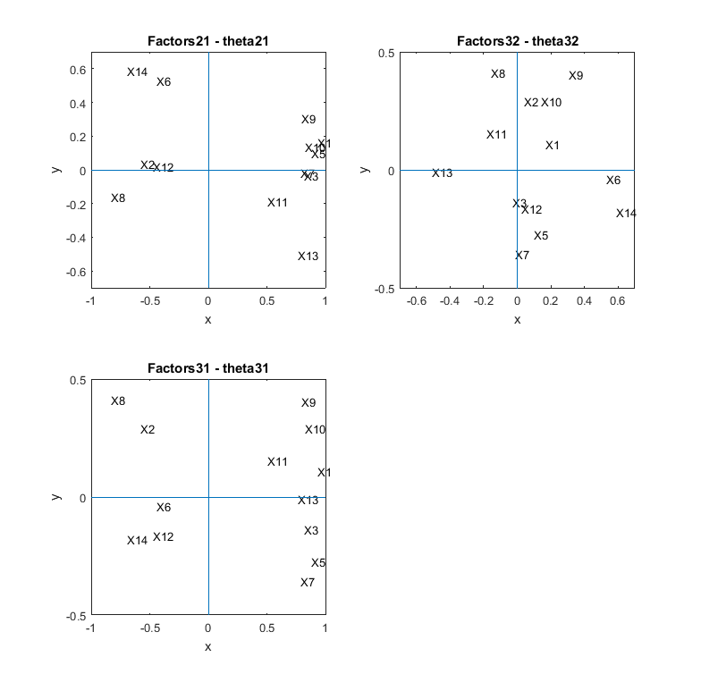
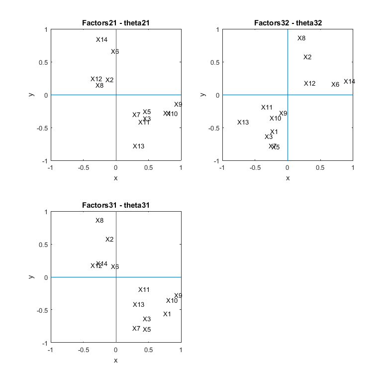
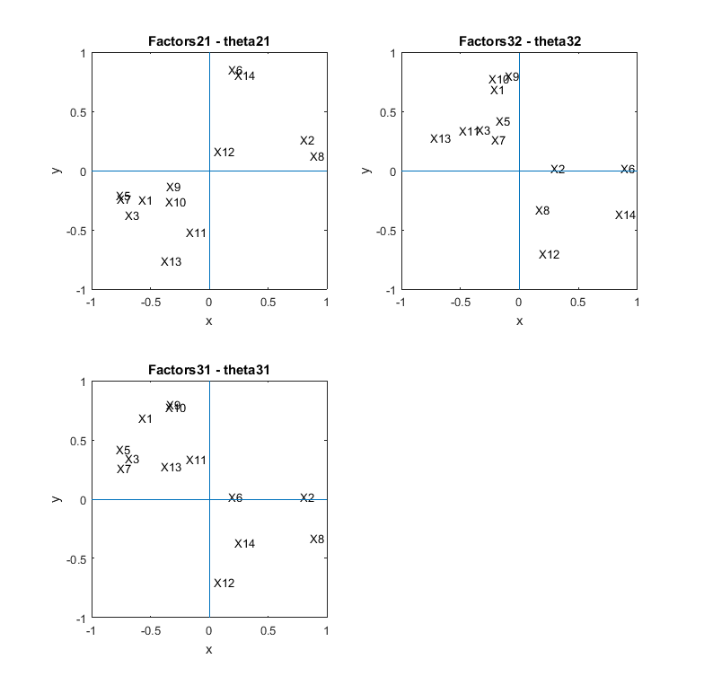

[](http://quantlet.de/)

## [](http://quantlet.de/) **MVAfacthous** [](http://quantlet.de/)

```yaml

Name of QuantLet: MVAfacthous

Published in: Applied Multivariate Statistical Analysis

Description: Performs factor analysis based on 3 factors for the transformed Boston housing data using three different methods.

Keywords: eigenvalues, factor analysis, likelihood, principal-components, spectral-decomposition, standardize, varimax, plot, graphical representation

Author: Zografia Anastasiadou
Author[Matlab]: Awdesch Melzer

Submitted: Fri, October 10 2014 by Sergey Nasekin
Submitted[Matlab]: Wed, December 14 by Piedad Castro

Datafiles: bostonh.dat

Example: 
- 1: Factor analysis for Boston housing data, Maximum Likelihood Method (MLM) without varimax rotation.
- 2: Factor analysis for Boston housing data, Maximum Likelihood Method (MLM) after varimax rotation.
- 3: Factor analysis for Boston housing data, Principal Factor Method (PFM) after varimax rotation.
- 4: Factor analysis for Boston housing data, Principal Component Method (PCM) after varimax rotation.

Note: 'Matlab and SAS decompose matrices differently than R, and therefore some 
      of the eigenvectors may have different signs.'

```










### R Code
```r


# clear variables and close windows
rm(list = ls(all = TRUE))
graphics.off()

# load data
data = read.table("bostonh.dat")

# transform data
xt = data
xt[, 1]  = log(data[, 1])
xt[, 2]  = data[, 2]/10
xt[, 3]  = log(data[, 3])
xt[, 5]  = log(data[, 5])
xt[, 6]  = log(data[, 6])
xt[, 7]  = (data[, 7]^(2.5))/10000
xt[, 8]  = log(data[, 8])
xt[, 9]  = log(data[, 9])
xt[, 10] = log(data[, 10])
xt[, 11] = exp(0.4 * data[, 11])/1000
xt[, 12] = data[, 12]/100
xt[, 13] = sqrt(data[, 13])
xt[, 14] = log(data[, 14])
data = xt[, -4]

colnames(data) = c("X1", "X2", "X3", "X5", "X6", "X7", "X8", "X9", "X10", "X11", "X12", 
    "X13", "X14") # rename variables
da  = scale(data) # standardize variables
dat = cor(da)     # correlation matrix

# Maximum Likelihood Factor Analysis without varimax rotation factanal performs
mlm  = factanal(da, 3, rotation = "none", covmat = dat)
load = mlm$loadings                           # estimated factor loadings
ld   = cbind(load[, 1], load[, 2], load[, 3]) # the estimated factor loadings matrix
com  = diag(ld %*% t(ld))                     # communalities are calculated
psi  = diag(dat) - diag(ld %*% t(ld))         # specific variances are calculated
tbl  = cbind(load[, 1], load[, 2], load[, 3], com, psi)

dev.new()
par(mfcol = c(2, 2))

# plot first factor against second
plot(load[, 1], load[, 2], type = "n", xlab = "x", ylab = "y", main = "Factors21 - theta21", 
    font.main = 1, cex.lab = 1.1, cex.axis = 1.1, cex.main = 1.4, ylim = c(-0.6, 0.6))
text(load[, 1], load[, 2], colnames(data), cex = 1.1)
abline(h = 0, v = 0)

# plot first factor against third
plot(load[, 1], load[, 3], type = "n", xlab = "x", ylab = "y", main = "Factors31 - theta31", 
    font.main = 1, cex.lab = 1.1, cex.axis = 1.1, cex.main = 1.4, ylim = c(-0.4, 0.4))
text(load[, 1], load[, 3], colnames(data), cex = 1.1)
abline(h = 0, v = 0)

# plot second factor against third
plot(load[, 2], load[, 3], type = "n", xlab = "x", ylab = "y", main = "Factors32 - theta32", 
    font.main = 1, cex.lab = 1.1, cex.axis = 1.1, cex.main = 1.4, xlim = c(-0.6, 0.6), 
    ylim = c(-0.4, 0.4))
text(load[, 2], load[, 3], colnames(data), cex = 1.1)
abline(h = 0, v = 0)

# Maximum Likelihood Factor Analysis after varimax rotation
var  = varimax(ld)                            # rotates the factor loadings matrix
load = var$loadings                           # estimated factor loadings after varimax
vl   = cbind(load[, 1], load[, 2], load[, 3])
com  = diag(vl %*% t(vl))                     # communalities are calculated
psi  = diag(dat) - diag(vl %*% t(vl))         # specific variances are calculated
tbl  = cbind(load[, 1], load[, 2], load[, 3], com, psi)

dev.new()
par(mfcol = c(2, 2))

# plot first factor against second
plot(load[, 1], load[, 2], type = "n", xlab = "x", ylab = "y", main = "Factors21 - theta21", 
    font.main = 1, cex.lab = 1.1, cex.axis = 1.1, cex.main = 1.4, xlim = c(-1, 1))
text(load[, 1], load[, 2], colnames(data), cex = 1.1)
abline(h = 0, v = 0)

# plot first factor against third
plot(load[, 1], load[, 3], type = "n", xlab = "x", ylab = "y", main = "Factors31 - theta31", 
    font.main = 1, cex.lab = 1.1, cex.axis = 1.1, cex.main = 1.4, xlim = c(-1, 1))
text(load[, 1], load[, 3], colnames(data), cex = 1.1)
abline(h = 0, v = 0)

# plot second factor against third
plot(load[, 2], load[, 3], type = "n", xlab = "x", ylab = "y", main = "Factors32 - theta32", 
    font.main = 1, cex.lab = 1.1, cex.axis = 1.1, cex.main = 1.4, xlim = c(-1, 1))
text(load[, 2], load[, 3], colnames(data), cex = 1.1)
abline(h = 0, v = 0)

# Principal Component Method after varimax rotation spectral decomposition
e      = eigen(dat)
eigval = e$values[1:3]
eigvec = e$vectors[, 1:3]
E      = matrix(eigval, nrow(dat), ncol = 3, byrow = T)
Q      = sqrt(E) * eigvec                     # the estimated factor loadings matrix
pcm    = varimax(Q)                           # rotates the factor loadings matrix
load   = pcm$loadings                         # estimated factor loadings after varimax
ld     = cbind(load[, 1], load[, 2], load[, 3])
com    = diag(ld %*% t(ld))                   # communalities are calculated
psi    = diag(dat) - diag(ld %*% t(ld))       # specific variances are calculated
tbl    = cbind(load[, 1], load[, 2], load[, 3], com, psi)

dev.new()
par(mfcol = c(2, 2))

# plot first factor against second
plot(load[, 1], load[, 2], type = "n", xlab = "x", ylab = "y", main = "Factors21 - theta21", 
    font.main = 1, cex.lab = 1.1, cex.axis = 1.1, cex.main = 1.4)
text(load[, 1], load[, 2], colnames(data), cex = 1.1)
abline(h = 0, v = 0)

# plot first factor against third
plot(load[, 1], load[, 3], type = "n", xlab = "x", ylab = "y", main = "Factors31 - theta31", 
    font.main = 1, cex.lab = 1.1, cex.axis = 1.1, cex.main = 1.4)
text(load[, 1], load[, 3], colnames(data), cex = 1.1)
abline(h = 0, v = 0)

# plot second factor against third
plot(load[, 2], load[, 3], type = "n", xlab = "x", ylab = "y", main = "Factors32 - theta32", 
    font.main = 1, cex.lab = 1.1, cex.axis = 1.1, cex.main = 1.4)
text(load[, 2], load[, 3], colnames(data), cex = 1.1)
abline(h = 0, v = 0)

# Principal Factor Method after varimax rotation inverse of the correlation matrix
f      = solve(dat)
psiini = diag(1/f[row(f) == col(f)]) # preliminary estimate of psi
psi    = psiini
for (i in 1:10) {
    ee     = eigen(dat - psi)
    eigval = ee$values[1:3]
    eigvec = ee$vectors[, 1:3]
    EE     = matrix(eigval, nrow(dat), ncol = 3, byrow = T)
    QQ     = sqrt(EE) * eigvec
    psiold = psi
    psi    = diag(as.vector(1 - t(colSums(t(QQ * QQ)))))
    i      = i + 1
    z      = psi - psiold
    convergence = z[row(z) == col(z)]
}
pfm  = varimax(QQ)                             # rotates the factor loadings matrix
load = pfm$loadings                            # estimated factor loadings after varimax
ld   = cbind(load[, 1], load[, 2], load[, 3])
com  = diag(ld %*% t(ld))                      # communalities are calculated
psi  = diag(dat) - diag(ld %*% t(ld))          # specific variances are calculated
tbl  = cbind(load[, 1], load[, 2], load[, 3], com, psi)

dev.new()
par(mfcol = c(2, 2))

# plot first factor against second
plot(load[, 1], load[, 2], type = "n", xlab = "x", ylab = "y", main = "Factors21 - theta21", 
    font.main = 1, cex.lab = 1.1, cex.axis = 1.1, cex.main = 1.4)
text(load[, 1], load[, 2], colnames(data), cex = 1.1)
abline(h = 0, v = 0)

# plot first factor against third
plot(load[, 1], load[, 3], type = "n", xlab = "x", ylab = "y", main = "Factors31 - theta31", 
    font.main = 1, cex.lab = 1.1, cex.axis = 1.1, cex.main = 1.4, ylim = c(-1, 1))
text(load[, 1], load[, 3], colnames(data), cex = 1.1)
abline(h = 0, v = 0)

# plot second factor against third
plot(load[, 2], load[, 3], type = "n", xlab = "x", ylab = "y", main = "Factors32 - theta32", 
    font.main = 1, cex.lab = 1.1, cex.axis = 1.1, cex.main = 1.4, ylim = c(-1, 1))
text(load[, 2], load[, 3], colnames(data), cex = 1.1)
abline(h = 0, v = 0)
```

automatically created on 2018-05-28

### MATLAB Code
```matlab

%% clear all variables and console and close windows
clear
clc
close all

%% load data
data = load('bostonh.dat');

%% Transformations
xt       = data;
xt(:, [1, 3, 5, 6, 8, 9, 10, 14]) = log(xt(:,[1, 3, 5, 6, 8, 9, 10, 14]));
xt(:, 2)  = data(:, 2)./10;
xt(:, 7)  = (data(:, 7).^(2.5))./10000;
xt(:, 11) = exp(0.4 * data(:, 11))./1000;
xt(:, 12) = data(:, 12)./100;
xt(:, 13) = sqrt(data(:, 13));
xt(:, 4)  = [];

%% standardizing data
n1 = length(xt);
m  = mean(xt);
zz = (xt - repmat(m,n1,1))./repmat(sqrt(var(xt)), n1, 1);

%% correlation matrix
dat = corr(zz);

% Maximum Likelihood Factor Analysis without varimax rotation
% factanal performs maximum-likelihood factor analysis
[lambda, ~, T, stats, F] = factoran(zz,3, 'xtype', 'data', 'rotate', 'none');
              
% estimated factor loadings
% the estimated factor loadings matrix
ld  = lambda;
com = diag(ld * ld');             %communalities are calculated
psi = diag(dat) - diag(ld * ld'); %specific variances are calculated
tbl = [lambda(:, 1), lambda(:, 2), lambda(:, 3), com, psi];

%% figure 1:
figure(1)
subplot(2, 2, 1)
% plot first factor against second
s = ['X1 '; 'X2 '; 'X3 '; 'X5 '; 'X6 '; 'X7 '; 'X8 '; 'X9 '; 'X10'; 
     'X11'; 'X12'; 'X13'; 'X14'];      % labels
hold on
plot(lambda(:, 1), lambda(:, 2),'w')
ylim([-0.7, 0.7])
title('Factors21 - theta21')
ylabel('y')
xlabel('x')
text(lambda(:, 1), lambda(:, 2), s)
line([-1, 1], [0, 0])
line([0, 0], [-1, 1])
box on
hold off

% plot first factor against third
subplot(2, 2, 3)
hold on
plot(lambda(:, 1), lambda(:, 3), 'w')
xlabel('x')
ylabel('y')
title('Factors31 - theta31')
ylim([-0.5, 0.5]) 
text(lambda(:, 1),lambda(:, 3), s)
line([-1, 1], [0, 0])
line([0, 0], [-1, 1])
box on
hold off

% plot second factor against third
subplot(2,2,2)
hold on
plot(lambda(:,2),lambda(:,3),'w')
xlabel('x')
ylabel('y')
title('Factors32 - theta32')
xlim([-0.7,0.7])
ylim([-0.5,0.5])
text(lambda(:,2),lambda(:,3),s)
line([-1,1],[0,0])
line([0,0],[-1,1])
box on
hold off

%% Maximum Likelihood Factor Analysis after varimax rotation 
lambda = rotatefactors(ld, 'Method','varimax');                
% rotates the factor loadings matrix
% and estimates factor loadings after varimax

vl  = [lambda(:,1),lambda(:,2),lambda(:,3)];
com = diag(vl*vl');             %communalities are calculated
psi = diag(dat)-diag(vl*vl');   %specific variances are calculated
tbl = [vl,com,psi];

%% figure 2:
figure(2)
% plot first factor against second
subplot(2,2,1)
hold on
plot(lambda(:,1),lambda(:,2),'w')
xlabel('x')
ylabel('y')
title('Factors21 - theta21')
text(lambda(:,1),lambda(:,2),s)
line([-1,1],[0,0])
line([0,0],[-1,1])
box on
hold off

% plot first factor against third
subplot(2,2,3)
plot(lambda(:,1),lambda(:,3),'w')
xlabel('x')
ylabel('y')
title('Factors31 - theta31')
text(lambda(:,1),lambda(:,3),s)
line([-1,1],[0,0])
line([0,0],[-1,1])
box on
hold off

% plot second factor against third
subplot(2,2,2)
hold on
plot(lambda(:,2),lambda(:,3),'w')
xlabel('x')
ylabel('y')
title('Factors32 - theta32')
text(lambda(:,2),lambda(:,3),s)
line([-1,1],[0,0])
line([0,0],[-1,1])
box on
hold off

%% Principal Component Method after varimax rotation
% spectral decomposition
[eigvec,eigval] = eigs(dat);
E               = ones(size(eigvec(:,1:3)))*eigval(1:3,1:3);

% the estimated factor loadings matrix
Q      = sqrt(E).*eigvec(:,1:3);
lambda = rotatefactors(Q, 'Method', 'varimax');                 
% rotates the factor loadings matrix
% and estimates factor loadings after varimax

ld  = [lambda(:,1),lambda(:,2),lambda(:,3)];
com = diag(ld*ld');             %communalities are calculated
psi = diag(dat)-diag(ld*ld');   %specific variances are calculated
tbl = [ld,com,psi];

%% figure 3:
figure(3)
% plot first factor against second
subplot(2,2,1)
hold on
plot(lambda(:,1),lambda(:,2),'w')
xlabel('x')
ylabel('y')
title('Factors21 - theta21')
text(lambda(:,1),lambda(:,2),s)
line([-1,1],[0,0])
line([0,0],[-1,1])
box on
hold off

% plot first factor against third
subplot(2,2,3)
plot(lambda(:,1),lambda(:,3),'w')
xlabel('x')
ylabel('y')
title('Factors31 - theta31')
text(lambda(:,1),lambda(:,3),s)
line([-1,1],[0,0])
line([0,0],[-1,1])
box on
hold off

% plot second factor against third
subplot(2,2,2)
hold on
plot(lambda(:,2),lambda(:,3),'w')
xlabel('x')
ylabel('y')
title('Factors32 - theta32')
text(lambda(:,2),lambda(:,3),s)
line([-1,1],[0,0])
line([0,0],[-1,1])
box on
hold off

%% Principal Factor Method after varimax rotation
% inverse of the correlation matrix dat
f = inv(dat);

% preliminary estimate of psi
psiini          = diag(diag(1./f));
psi             = psiini;
[eigvec,eigval] = eigs(dat-psi); 
EE              = ones(size(eigvec(:,1:3)))*eigval(1:3,1:3);
QQ              = sqrt(EE).*eigvec(:,1:3);
psiold          = psi;
psi             = diag(1-sum((QQ.*QQ)'));
z               = psi-psiold;
convergence     = z;
lambda          = rotatefactors(QQ, 'Method', 'varimax');                
% rotates the factor loadings matrix
% and estimates factor loadings after varimax

ld  = [lambda(:,1),lambda(:,2),lambda(:,3)];
com = diag(ld*ld');                % communalities are calculated
psi = diag(dat)-diag(ld*ld');      % specific variances are calculated
tbl = [ld,com,psi];

%% figure 4:
figure(4)
% plot first factor against second
subplot(2,2,1)
hold on
plot(lambda(:,1),lambda(:,2),'w')
xlabel('x')
ylabel('y')
title('Factors21 - theta21')
text(lambda(:,1),lambda(:,2),s)
line([-1,1],[0,0])
line([0,0],[-1,1])
box on
hold off

% plot first factor against third
subplot(2,2,3)
plot(lambda(:,1),lambda(:,3),'w')
xlabel('x')
ylabel('y')
title('Factors31 - theta31')
text(lambda(:,1),lambda(:,3),s)
line([-1,1],[0,0])
line([0,0],[-1,1])
box on
hold off

% plot second factor against third
subplot(2,2,2)
hold on
plot(lambda(:,2),lambda(:,3),'w')
xlabel('x')
ylabel('y')
title('Factors32 - theta32')
text(lambda(:,2),lambda(:,3),s)
line([-1,1],[0,0])
line([0,0],[-1,1])
box on
hold off

```

automatically created on 2018-05-28