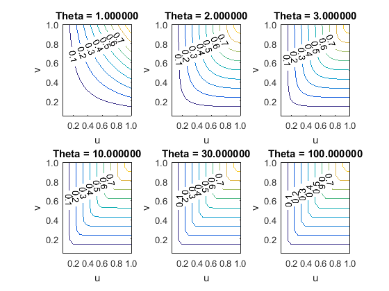

[](http://quantlet.de/)

## [](http://quantlet.de/) **MVAghcontour** [](http://quantlet.de/)

```yaml

Name of QuantLet: MVAghcontour

Published in: Applied Multivariate Statistical Analysis

Description: Gives contour plots of Gumbel-Hougard copula for different theta values (1, 2, 3, 10, 30 and 100).

Keywords: contour, copula, gumbel, plot, graphical representation

See also: MVAsample1000

Author: Song Song

Submitted: Thu, August 04 2011 by Awdesch Melzer
Submitted[Matlab]: Thu, November 24 2016 by Lily Medina

```




### R Code
```r


# clear variables and close windows
rm(list = ls(all = TRUE))
graphics.off()

# Gumbel H Copula is defined as: C(u,v) = exp - ( (-log u)^theta + (-log
# v)^theta )^(1/theta)

f = function(u, v, theta) {
    exp(-((-log(u))^theta + (-log(v))^theta)^(1/theta))
}

N = 21
v = u = seq(0, 1, by = 0.05)
uu = rep(u, N)
vv = rep(v, each = N)
op = par(mfrow = c(2, 3))
theta = 1

# Contour plots with different theta parameters
w = matrix(f(uu, vv, theta), nr = N)
contour(w, cex.axis = 2, cex.lab = 2, main = "Theta 1.000", xlab = "u", ylab = "v", 
    xlim = c(0, 1), ylim = c(0, 1))
theta = 2

w = matrix(f(uu, vv, theta), nr = N)
contour(w, cex.axis = 2, cex.lab = 2, main = "Theta 2.000", xlab = "u", ylab = "v", 
    xlim = c(0, 1), ylim = c(0, 1))
theta = 3

w = matrix(f(uu, vv, theta), nr = N)
contour(w, cex.axis = 2, cex.lab = 2, main = "Theta 3.000", xlab = "u", ylab = "v", 
    xlim = c(0, 1), ylim = c(0, 1))
theta = 10

w = matrix(f(uu, vv, theta), nr = N)
contour(w, cex.axis = 2, cex.lab = 2, main = "Theta 10.000", xlab = "u", ylab = "v", 
    xlim = c(0, 1), ylim = c(0, 1))
theta = 30

w = matrix(f(uu, vv, theta), nr = N)
contour(w, cex.axis = 2, cex.lab = 2, main = "Theta 30.000", xlab = "u", ylab = "v", 
    xlim = c(0, 1), ylim = c(0, 1))
theta = 100

w = matrix(f(uu, vv, theta), nr = N)
contour(w, cex.axis = 2, cex.lab = 2, main = "Theta 100.000", xlab = "u", ylab = "v", 
    xlim = c(0, 1), ylim = c(0, 1))

par(op)
```

automatically created on 2018-05-28

### MATLAB Code
```matlab

%% clear variables and close windows
clear all
close all
clc

%% set input
N       = 21;
v       = 0:0.05:1;
u       = v;
[uu vv] = meshgrid(u,v);

%% plot contours
for i = 1:6
theta  = [1, 2, 3, 10, 30, 100];
subplot(2,3,i)
gumbel = exp(-(((-log(uu)).^theta(i) ) + ((-log(vv)).^theta(i) )).^(1/theta(i)));
contour(gumbel,'ShowText','on') 
str    = sprintf('Theta = %f',theta(i)); 
title(str)
set(gca,'XTick',[0 4.2 8.4 12.6 16.8 21])
set(gca,'XTickLabel',['0.0'; '0.2'; '0.4'; '0.6'; '0.8'; '1.0'])
set(gca,'YTick',[0 4.2 8.4 12.6 16.8 21])
set(gca,'YTickLabel',['0.0';'0.2'; '0.4'; '0.6'; '0.8'; '1.0'])
xlabel('u')
ylabel('v')
end

```

automatically created on 2018-05-28