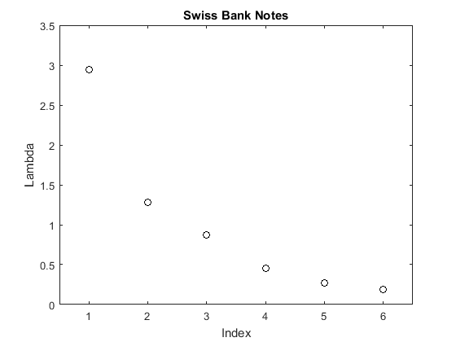
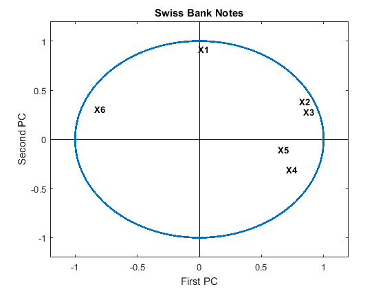
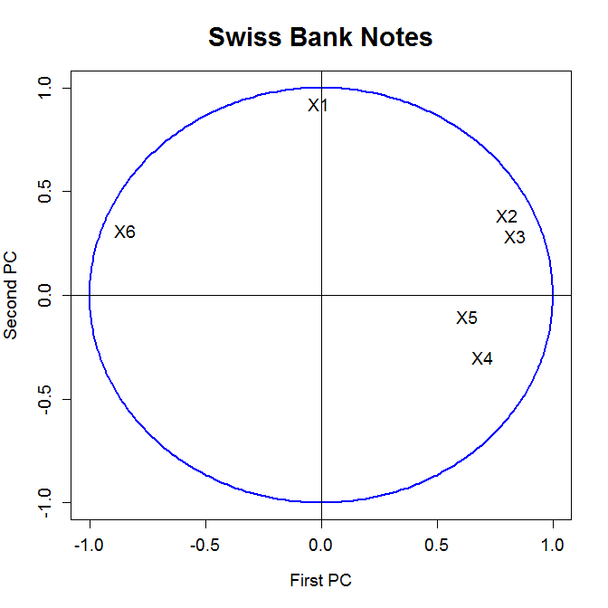

[](http://quantlet.de/)

## [](http://quantlet.de/) **MVAnpcabanki** [](http://quantlet.de/)

```yaml

Name of QuantLet: MVAnpcabanki

Published in: Applied Multivariate Statistical Analysis

Description: Shows a scree plot of the eigenvalues for the PCA of the standardized Swiss bank notes. Additionally, it computes the correlations between the variables and the principal components and displays the first two of them.

Keywords: principal-components, pca, npca, eigenvalues, standardization, correlation, screeplot, plot, graphical representation, data visualization, sas

See also: MVAnpcabank, MVAnpcahous, MVAnpcahousi, MVAnpcatime, MVAnpcafood, MVAnpcausco, MVAnpcausco2, MVAnpcausco2i, MVAcpcaiv, MVApcabank, MVApcabanki, MVApcabankr, MVApcasimu

Author: Zografia Anastasiadou
Author[SAS]: Svetlana Bykovskaya
Author[Matlab]: Jorge Patron, Vladimir Georgescu, Song Song

Submitted: Tue, March 11 2014 by Awdesch Melzer
Submitted[SAS]: Wed, April 06 2016 by Svetlana Bykovskaya
Submitted[Matlab]: Tue, December 13 2016 by Piedad Castro

Datafile: bank2.dat

Example: 
- 1: Scree plot of the eigenvalues for the PCA of the standardized Swiss bank notes.
- 2: The correlations of the original variables with the PCs.

Note: 'Matlab and SAS decompose matrices differently than R, and therefore some 
      of the eigenvectors may have different signs.'

```









### MATLAB Code
```matlab

%% clear all variables and console and close windows
clear
clc
close all

%% load data
x = load('bank2.dat');

% Vector with ones in the first 100 entries and zeros in the rest
% that enables us to use the 'gscatter'command to plot the data in groups.
groups = vertcat(ones(100,1),zeros(100,1));                

[n,p] = size(x);
m     = mean(x);
x     = (x-repmat(m,n,1)).*repmat(1./sqrt(var(x)),n,1);   % standardizes the data matrix
[v,e] = eigs(cov(x),p,'la');  % eigenvalues sorted by size from largest to smallest(Note: Command generates a Warning(Disregard it)) 
e1    = diag(e);              % creates column vector of eigenvalues

% change the signs of some eigenvector. This is done only to make easier
% the comparison with R results.
v(:,[1,5,6]) = -v(:,[1,5,6]);

%% plot, eigenvalues
figure
nr = 1:6;
scatter(nr,e1,'k')
box on
xlabel('Index')
ylabel('Lambda')
title('Swiss Bank Notes')
xlim([0.5 6.5])
ylim([0 3.5])

m    = mean(x);
temp = x-repmat(m,n,1);
r    = temp*v;
r    = corr([r x]);   % correlation between PCs and variables
r1   = r(7:12,1:2);   % correlation between the first two PCs and variables

%% plot
figure
hold on
box on
xlim([-1.2 1.2])
ylim([-1.2 1.2])
line([-1.2 1.2],[0 0],'Color','k')
line([0 0],[1.2 -1.2],'Color','k')
title('Swiss Bank Notes')
xlabel('First PC')
ylabel('Second PC')
circle = rsmak('circle');
fnplt(circle)
for i=1:length(r1)
    text(r1(i,1),r1(i,2),strcat('X',int2str(i)),'FontSize',10,'FontWeight','bold')
end
hold off

```

automatically created on 2018-05-28

### R Code
```r


# clear all variables
rm(list = ls(all = TRUE))
graphics.off()

# load data
x = read.table("bank2.dat")

x  = scale(x)       # standardizes the data matrix
n  = nrow(x)
e  = eigen(cov(x))  # calculates eigenvalues and eigenvectors and sorts them by size
e1 = e$values

# Plot 1: the relative proportion of variance explained by PCs
dev.new()
plot(e1, xlab = "Index", ylab = "Lambda", main = "Swiss Bank Notes", cex.lab = 1.2, 
    cex.axis = 1.2, cex.main = 1.8)
m    = apply(x, 2, mean)
temp = as.matrix(x - matrix(m, n, ncol(x), byrow = T))
r    = temp %*% e$vectors
r    = cor(cbind(r, x))      # correlation between PCs and variables
r1   = r[7:12, 1:2]          # correlation of the two most important PCs and variables

# Plot 2: the correlations of the original variables with the PCs
dev.new()
ucircle = cbind(cos((0:360)/180 * pi), sin((0:360)/180 * pi))
plot(ucircle, type = "l", lty = "solid", col = "blue", xlab = "First PC", ylab = "Second PC", 
    main = "Swiss Bank Notes", cex.lab = 1.2, cex.axis = 1.2, cex.main = 1.8, lwd = 2)
abline(h = 0, v = 0)
label = c("X1", "X2", "X3", "X4", "X5", "X6")
text(r1, label, cex = 1.2) 

```

automatically created on 2018-05-28

### SAS Code
```sas


* Import the data;
data b2;
  infile '/folders/myfolders/Sas-work/data/bank2.dat';
  input x1-x6;
run;

* standardize the data matrix;
proc standard data = b2 mean = 0 std = 1 out = y;
  var x1 x2 x3 x4 x5 x6;
run;

proc iml;
  * Read data into a matrix;
  use y;
    read all var _ALL_ into x; 
  close y;
  
  n  = nrow(x);
  e  = cov(x);
  e2 = eigval(e);
  e1 = 1:nrow(e2);
  
  m  = x[:];
  t  = x - repeat(m, n, ncol(x));
  r  = t * eigvec(e);
  r  = corr(r || x);    * correlation between PCs and variables;
  r  = r[7:12, 1:2];    * correlation of the two most important PCs and variables;
  
  r1 = -r[,1];
  r2 = r[,2];
  
  pi = constant("pi");
  uc = (cos((0:360)/180 * pi) // sin((0:360)/180 * pi))`;
  u1 = uc[,1];
  u2 = uc[,2];
  names = {"X1", "X2", "X3", "X4", "X5", "X6"};

  create plot var {"e1" "e2" "u1" "u2" "r1" "r2" "names"};
    append;
  close plot;
quit;

* Plot 1: the relative proportion of variance explained by PCs;
proc sgplot data = plot
    noautolegend;
  title 'Eigenvalues of S';
  scatter x = e1 y = e2 / markerattrs = (color = blue);
  xaxis label = 'Index';
  yaxis label = 'Lambda';
run;

* Plot 2: the correlations of the original variables with the PCs;
proc sgplot data = plot
    noautolegend;
  title 'Swiss Bank Notes';
  series  x = u1 y = u2 / lineattrs = (color = blue THICKNESS = 2);
  scatter x = r1 y = r2 / markerattrs = (color = black symbol = circlefilled)
    datalabel = names;
  refline 0 / lineattrs = (color = black);
  refline 0 / axis = x lineattrs = (color = black);
  xaxis label = 'First PC';
  yaxis label = 'Second PC';
run;

   
```

automatically created on 2018-05-28