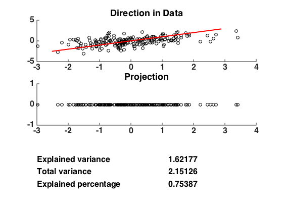

[](http://quantlet.de/)

## [](http://quantlet.de/) **MVApcasimu** [](http://quantlet.de/)

```yaml

Name of QuantLet: MVApcasimu

Published in: Applied Multivariate Statistical Analysis

Description: Simulates a projection of a (normal) point cloud which may capture different proportions of the variance. 

Keywords: principal-components, pca, eigenvalues, projection, screeplot, scatterplot, plot, graphical representation, simulation

See also: MVAnpcabanki, MVAnpcabank, MVAnpcahousi, MVAnpcatime, MVAnpcafood, MVAnpcausco, MVAnpcausco2, MVAnpcausco2i, MVAcpcaiv, MVAnpcahous, MVApcabanki, MVApcabankr, MVApcabank

Author: Zografia Anastasiadou, Maria Osipenko
Author[Matlab]: Zografia Anastasiadou, Maria Osipenko

Submitted: July 01 2014 by Petra Burdejova
Submitted[Matlab]: Mon, December 12 2016 by Piedad Castro

Example: 
- 1: Direction of first component for simulated data.
- 2: Direction of second component for simulated data.

Note: 'Matlab and SAS decompose matrices differently than R, and therefore some 
      of the eigenvectors may have different signs.'

```




### MATLAB Code
```matlab

%% clear all variables and console and close windows
clear
clc
close all

%% parameter settings
rng(123)    % set seed for the generation of random numbers
n   = 200;
rho = 0.5;
mu  = [0 0];
sig = [1 rho; rho 1];

[vector,value] = eig(sig);
ll             = sqrt(value);
sh             = vector*ll*vector';
nr             = mvnrnd(mu,sig,n);
x              = nr*sh';

direction1 = vector(:,2);
direction2 = -vector(:,1);
norm       = [direction1'*direction1 direction1'*direction1];
direction1 = direction1./sqrt(norm(1));
direction2 = direction2./sqrt(norm(2));

pd1     = sort(x*direction1);  % give the magnitude
d31     = pd1*direction1';     % "direction" controls the direction
pd2     = sort(x*direction2);  % give the magnitude
d32     = pd2*direction2';     % "direction" controls the direction
d4(:,1) = x(:,1);
d4(:,2) = 0;
d5(:,1) = x(:,2);
d5(:,2) = 0;

%% plots, first component
figure
%% direction in data 
subplot(3,1,1,'FontSize',16,'FontWeight','bold');
title('Direction in Data');
hold on
scatter(x(:,1),x(:,2),'k');
plot(d31(:,1),d31(:,2),'r','LineWidth',2);
%% projection
subplot(3,1,2,'FontSize',16,'FontWeight','bold');
title('Projection');
hold on
scatter(d4(:,1),d4(:,2),'k');
%% information
subplot(3,1,3,'FontSize',16','FontWeight','bold');
varexp  = var(pd1);
varsum  = sum(var(x));
varperc = varexp/varsum;
axis off
text(0,0.7,'Explained variance','FontSize',16,'FontWeight','bold');
w = num2str(varexp,'%10.5f');
text(0.6,0.7,w,'FontSize',16,'FontWeight','bold');
text(0,0.4,'Total variance','FontSize',16,'FontWeight','bold');
w = num2str(varsum,'%10.5f');
text(0.6,0.4,w,'FontSize',16,'FontWeight','bold');
text(0,0.1,'Explained percentage','FontSize',16,'FontWeight','bold');
w = num2str(varperc,'%10.5f');
text(0.6,0.1,w,'FontSize',16,'FontWeight','bold');

%% plots, second component
figure
%% direction in data 
subplot(3,1,1,'FontSize',16,'FontWeight','bold');
title('Direction in Data');
hold on
scatter(x(:,1),x(:,2),'k');
plot(d32(:,1),d32(:,2),'r','LineWidth',2);
%% projection
subplot(3,1,2,'FontSize',16,'FontWeight','bold');
title('Projection');
hold on
scatter(d5(:,1),d5(:,2),'k');
%% information
subplot(3,1,3,'FontSize',16','FontWeight','bold');
varexp  = var(pd2);
varsum  = sum(var(x));
varperc = varexp/varsum;
axis off
text(0,0.7,'Explained variance','FontSize',16,'FontWeight','bold');
w = num2str(varexp,'%10.5f');
text(0.6,0.7,w,'FontSize',16,'FontWeight','bold');
text(0,0.4,'Total variance','FontSize',16,'FontWeight','bold');
w = num2str(varsum,'%10.5f');
text(0.6,0.4,w,'FontSize',16,'FontWeight','bold');
text(0,0.1,'Explained percentage','FontSize',16,'FontWeight','bold');
w=num2str(varperc,'%10.5f');
text(0.6,0.1,w,'FontSize',16,'FontWeight','bold');

```

automatically created on 2018-05-28

### R Code
```r


# clear all variables
rm(list = ls(all = TRUE))
graphics.off()

# install and load packages
libraries = c("mvtnorm")
lapply(libraries, function(x) if (!(x %in% installed.packages())) {
    install.packages(x)
})
lapply(libraries, library, quietly = TRUE, character.only = TRUE)

# parameter settings
set.seed(123)
n   = 200
rho = 0.5
mu  = c(0, 0)
sig = matrix(c(1, rho, rho, 1), nrow = 2)

nr  = rmvnorm(n, mu, sig)
eig = eigen(sig)
l   = eig$values
g   = eig$vectors
sh  = g %*% diag(sqrt(l)) %*% t(g)
x   = nr %*% t(sh)

direction1 = g[, 1]
direction2 = g[, 2]
norm       = c(t(direction1) %*% direction1, t(direction2) %*% direction2)
direction1 = direction1 / sqrt(norm[1])
direction2 = direction2 / sqrt(norm[2])

pd1 = sort(x %*% direction1)
d31 = pd1 %*% t(direction1)
pd2 = sort(x %*% direction2)
d32 = pd2 %*% t(direction2)
d4  = cbind(x[, 1], matrix(0, nrow = n))
d5  = cbind(x[, 2], matrix(0, nrow = n))

# plots of diection in simulated data and data projection with explained variance
dev.new()
par(mfrow = c(2, 1))
plot(x[, 1], x[, 2], , xlab = "", ylab="", main = "Direction in Data",
     cex.axis = 1.2, cex.main = 1.8)
lines(d31[, 1], d31[, 2], col = "red", lwd = 3)
plot(d4[, 1], d4[, 2], xlab = "", ylab = "", main = "Projection",
     cex.axis = 1.2, cex.main = 1.8)

varexp1  = var(pd1)
r1       = round(varexp1, 2)
w11      = toString(r1)
varexp2  = var(pd2)
r2       = round(varexp2,2)
w12      = toString(r2)
varsum   = sum(t(c(var(x[, 1]), var(x[, 2]))))
r2       = round(varsum, 2)
w2       = toString(r2)
varperc1 = varexp1 / varsum
r31      = round(varperc1, 2)
w31      = toString(r31)
varperc2 = varexp2 / varsum
r32      = round(varperc2, 2)
w32      = toString(r32)

mtext("Explained variance", side = 1, line = 2, at = -2, font = 2)
mtext(w11, side = 1, line = 2, at = -0.7, font = 2)
mtext("Total variance", side = 1, line = 3, at = -2.2, font = 2)
mtext(w2, side = 1, line = 3, at = -0.7, font = 2)
mtext("Explained percentage", side = 1, line = 4, at = -1.9, font = 2)
mtext(w31, side = 1, line = 4, at = -0.7, font = 2)

dev.new()
par(mfrow = c(2, 1))
plot(x[, 1], x[, 2], , xlab = "", ylab = "", main = "Direction in Data",
     cex.axis = 1.2, cex.main = 1.8)
lines(d32[, 1], d32[, 2], col = "red", lwd = 3)
plot(d5[, 1], d5[, 2], xlab = "", ylab = "", main = "Projection",
     cex.axis = 1.2, cex.main = 1.8)
mtext("Explained variance", side = 1, line = 2, at = -2, font = 2)
mtext(w12, side = 1, line = 2, at = -0.7, font = 2)
mtext("Total variance", side = 1, line = 3, at = -2.2, font = 2)
mtext(w2, side = 1, line = 3, at = -0.7, font = 2)
mtext("Explained percentage", side = 1, line = 4, at = -1.9, font = 2)
mtext(w32, side = 1, line = 4, at = -0.7, font = 2)

```

automatically created on 2018-05-28