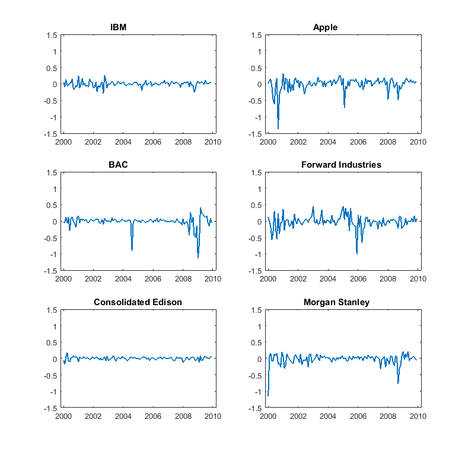

[](http://quantlet.de/)

## [](http://quantlet.de/) **MVAreturns** [](http://quantlet.de/)

```yaml

Name of QuantLet: MVAreturns

Published in: Applied Multivariate Statistical Analysis

Description: Shows monthly returns of six US firms from Jan 2000 to Dec 2009.

Keywords: financial, portfolio, returns, asset, time-series, data visualization, plot, graphical representation

See also: MVAportfol_IBM_Ford, MVAportfol_IBM_PanAm

Author: Zografia Anastasiadou

Author[Matlab]: Zografia Anastasiadou, Awdesch Melzer, Piedad Castro

Submitted: Fri, August 05 2011 by Awdesch Melzer
Submitted[Matlab]: Wed, December 21 2016 by Piedad Castro

Datafile: apple.csv, bac.csv, ed.csv, ford.csv, ibm.csv, ms.csv

```




### MATLAB Code
```matlab

%% clear all variables and console and close windows
clear
clc
close all

%% load data
formatSpec = '%{yyyy-MM-dd}D%f%f%f%f%f%f';
ibm        = readtable('ibm.csv', 'Delimiter', ',', 'Format', formatSpec);
apple      = readtable('apple.csv', 'Delimiter', ',', 'Format', formatSpec);
bac        = readtable('bac.csv', 'Delimiter', ',', 'Format', formatSpec);
ford       = readtable('ford.csv', 'Delimiter', ',', 'Format', formatSpec);
ed         = readtable('ed.csv', 'Delimiter', ',', 'Format', formatSpec);
ms         = readtable('ms.csv', 'Delimiter', ',', 'Format', formatSpec);

%% sort data by date
ibm   = sortrows(ibm, 'Date', 'ascend');
apple = sortrows(apple, 'Date', 'ascend');
bac   = sortrows(bac, 'Date', 'ascend');
ford  = sortrows(ford, 'Date', 'ascend');
ed    = sortrows(ed, 'Date', 'ascend');
ms    = sortrows(ms, 'Date', 'ascend');
    
%% compute the returns for IBM
y1 = table2array(ibm(:, 5));
x1 = diff(y1) ./ y1(2:end);

%% compute the returns for Apple
y2 = table2array(apple(:,5));
x2 = diff(y2) ./ y2(2:end);

%% compute the returns for Bank of America Corporation
y3 = table2array(bac(:,5));
x3 = diff(y3) ./ y3(2:end);
	
%% compute the returns for Forward Industries
y4 = table2array(ford(:,5));
x4 = diff(y4) ./ y4(2:end);

%% compute the returns for Consolidated Edison
y5 = table2array(ed(:,5));
x5 = diff(y5) ./ y5(2:end);

%% compute the returns for Morgan Stanley
y6 = table2array(ms(:,5));
x6 = diff(y6) ./ y6(2:end);

Date  = ibm.Date(2:end);
NAMES = ['IBM                '; 'Apple              ';
         'BAC                '; 'Forward Industries ';
         'Consolidated Edison'; 'Morgan Stanley     '];
xx    = [x1, x2, x3, x4, x5, x6];

%% plot
figure(1)
for i = 1:6
    subplot(3, 2, i)
    plot(Date, xx(:,i), 'LineWidth', 1.2)
    ylim([-1.5, 1.5])
    title(NAMES(i, :))
end

```

automatically created on 2018-05-28

### R Code
```r

# clear all variables
rm(list = ls(all = TRUE))
graphics.off()

# load data
ibm   = read.csv("ibm.csv")
apple = read.csv("apple.csv")
bac   = read.csv("bac.csv")
ford  = read.csv("ford.csv")
ed    = read.csv("ed.csv")
ms    = read.csv("ms.csv")

# sort data by date
ibm$Date   = as.Date(ibm$Date, "%Y-%m-%d") # this variable is the same in all data sets
OrderIndex = order(ibm$Date)
ibm        = ibm[OrderIndex, ]
apple      = apple[OrderIndex, ]
bac        = bac[OrderIndex, ]
ford       = ford[OrderIndex, ]
ed         = ed[OrderIndex, ]

end = nrow(ibm)  # number of ibservations

# compute returns for IBM
y1 = ibm[, 5]
x1 = diff(y1)/y1[2:end]

# compute returns for Apple
y2 = apple[, 5]
x2 = diff(y2)/y2[2:end]

# compute returns for Bank of America Corporation
y3 = bac[, 5]
x3 = diff(y3)/y3[2:end]

# compute returns for Forward Industries
y4 = ford[, 5]
x4 = diff(y4)/y4[2:end]

# compute returns for Consolidated Edison
y5 = ed[, 5]
x5 = diff(y5)/y5[2:end]

# compute returns for Morgan Stanley
y6 = ms[, 5]
x6 = diff(y6)/y6[2:end]

Date  = ibm$Date[2:end]
NAMES = c("IBM", "Apple", "BAC", "Forward Industries",
           "Consolidated Edison", "Morgan Stanley")
xx    = cbind(x1, x2, x3, x4, x5, x6)

# plot
par(mfrow = c(3, 2))
for (i in 1:6){
  plot(Date, xx[, i], type = "l", col = "blue", ylim = c(-1.5, 1.5), 
       ylab = "", xlab = "", main = NAMES[i], 
       cex.lab = 1.4, cex.axis = 1.4, cex.main = 1.4)
}

```

automatically created on 2018-05-28