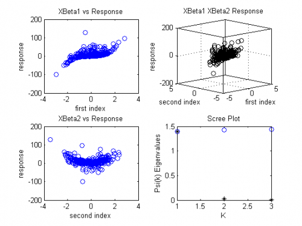
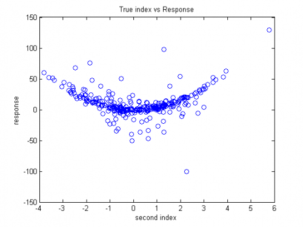
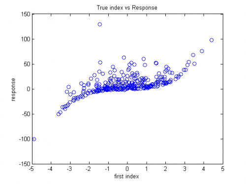

[](http://quantlet.de/)

## [](http://quantlet.de/) **MVAsirdata** [](http://quantlet.de/)

```yaml

Name of QuantLet: MVAsirdata

Published in: Applied Multivariate Statistical Analysis

Description: Generates a data set and applies the sliced inverse regression algorithm (SIR) for dimension reduction.

Keywords: EDR-directions, dimension-reduction, estimation, SIR, regression, 3D, plot, graphical representation

See also: MVAppsib, MVAsimdep1, MVAsir2data, MVAsimdepex, MVAppexample, ppsib, ppsibexample

Author: Zografia Anastasiadou

Submitted: Fri, August 05 2011 by Awdesch Melzer

Example: 
- 1: The left plots show the response versus the estimated effective dimension reduction directions (EDR-directions). The upper right plot is a three-dimensional plot of the first two directions and the response.  The lower right plot shows the eigenvalues (*) and the cumulative sum (o).
- 2: Plot of the true response versus the first true index. The monotonic and the convex shapes can be clearly seen.
- 3: Plot of the true response versus the second true index. The monotonic and the convex shapes can be clearly seen.

```










### MATLAB Code
```matlab

% ------------------------------------------------------------------------------
% Book:         MVA
% ------------------------------------------------------------------------------
% Quantlet:     MVAsirdata
% ------------------------------------------------------------------------------
% Description:  MVAsirdata generates a data set and applies the sliced inverse 
%               regression algorithm (SIR) for dimension reduction.
% ------------------------------------------------------------------------------
% Usage:        -
% ------------------------------------------------------------------------------
% Inputs:       None      
% ------------------------------------------------------------------------------
% Output:       Effective dimension reduction directions (EDR-directions) for the 
%               simulated data and plots for the response versus the estimated 
%               EDR-directions, a three-dimensional plot for the first two 
%               directions and the response, plot for the eigenvalues and the 
%               cumulative sum and plots for the true response versus the true 
%               indices.
% ------------------------------------------------------------------------------
% Example:      -
% ------------------------------------------------------------------------------
% Author:       Zografia Anastasiadou 20100805;
%               Awdesch Melzer 20120417
% ------------------------------------------------------------------------------

%clear variables and close windows
clear all;
close all;
clc

%number of observations
n = 300;
%number of elements in each slice
ns = 20; 
%number of slices
hOld = floor(n/ns);
%n x 3 matrix, the explanatory variable
x = normrnd(0,1,n,3);
%n vector, the noise variable
e = normrnd(0,1,n,1);
%projection vectors
b2 = [1,-1,-1]';
b1 = [1,1,1]';
%n vector, the response variable
y = x*b1+((x*b1).^3)+4*((x*b2).^2)+e;
h=-20;

[n ndim] = size(x); % number of observations and number of dimension                    
  
% calculate the covariance matrix and its inverse root to standardize X
% step 1 in original article

  xb   = mean(x);                         % mean of x                       
  s    = (x'*x - n.*xb'*xb)./(n-1);       % cov of x                        
  [evec,eval] = eigs(s);                % eigendecomposititon of cov   
  si2  = evec*diag(sqrt(1./diag(eval)))*evec';  % compute cov(x)^(-1/2)        
  xt   = (x-repmat(xb,length(x),1))*si2;                      % stand. x to mean=0, cov=I    

% construct slices in Y space
%  step 2 in original article

  data  = sortrows([y,xt]);    

  
  % build slices 
%  ns     = number of slices 
%  condit = n values controlling which x-data fall
%           in a slice depending on choic
%  choice = vector of ns choices to build the slice subset of x 
% case 1: h<=-2  -> each slice with <= abs(h) elements                   
% if n div h != 0 then the first and last slice get the remainder        
  h = abs(h);
  ns = floor(n / h);
  condit = [1:1:n]'; % enumber the x values             
  choice0 = [1:1:ns]';
  choice = [choice0.*h];         % take h values in each slice      
  if (h*ns ~= n)                     % if there are remaining values    
    hk = floor((n-h*ns)/2);
    if (hk>=0)
      choice = [hk;choice+hk];          % generate a new first ...         
    end
    choice = [choice;n];              % ... and last slice               
  end
  ns = length(choice);                  % number of slices 
  
  

%   compute width of slices and vector of upper limit of slice intervals  

  slwidth = (data(n,1) - data(1,1))/h;
  first = data(1,1)-slwidth;
  last=data(n,1);
  slend   = first:slwidth:last;
  if (slend(ns) > data(n-1,1))      % does only the last value            
    slend(ns) = data(n,1);           % lay behind the last slice ?         
  else
    slend = [slend,data(n,1)];         % if not, build another slice         
  end
  condit = data(:,1);                 % choose on original y values  
  choice = slend';                    % choice to end of slice              
  ns     = length(choice);             % compute the number of slices        
 
  %  run over all slices, compute estimate for V = Cov(E(x|y))            
%  step 3                
  

  hk   = 0;
    % initialise V matrix                        
  ind  = ones(n,1);             % index vector of length n% 0 means,         
  j=0;
  sborder=0;
  v=0;
while j<ns
    j=j+1;
         sborder = (condit(:) <= choice(j)); % sborder is index            
  
  p = sum(sborder);                      % if jth obs. belongs         
  
  % current slice               
  if p~=0
  ind    = ind - sborder;              % don't take this values        
                                          % in further slices           
      xslice = data(find(sborder),2:end); % get sliced x-values         
      xmean  = mean(xslice);
      v = v + xmean'*xmean*length(xslice);      % compute V                   
      hk = hk+1;
  end
end
  
    v1          = (v+v')/2/n;              % for numerical errors 
  [b,eigen] = eigs (v1);               % step 5, eigenvectors of V  
  b          = si2 * b;                 % calculate e.d.r. direction 
  data       = sqrt(sum(b.^2))';         % ... and standardize them   
  edr        = b./repmat(data,1,3);
  
  f=edr;
  g=diag(eigen);
  
  

%matrices for the true indices and the true responses 
m1 = [x*b1,y];
m2 = [x*b2,y];
m1 = sortrows(m1,1);
m2 = sortrows(m2,1);

sg = sum(g);
g = g/sg;
%the ratio of the sum of the 3 eigenvalues and the sum of all eigenvalues
psi = [g(1),g(1)+g(2),g(1)+g(2)+g(3)]';

figure(1)
subplot(2,2,1)
%plot of the response versus the first estimated EDR-direction
p11 = [x*f(:,1),y];
plot(p11(:,1),p11(:,2),'bo')
xlabel('first index')
ylabel('response')
title('XBeta1 vs Response')
box on

%plot of the response versus the second estimated EDR-direction
subplot(2,2,3)
p21 = [x*f(:,2),y];
plot(p21(:,1),p21(:,2),'bo')
xlabel('second index')
ylabel('response')
title('XBeta2 vs Response')
box on
%three-dimensional plot of the first two directions and the response
subplot(2,2,2)
p12 = [x*f(:,1),x*f(:,2),y];
scatter3(p12(:,1),p12(:,2),p12(:,3),'ko'),view(-60,80)
view(-44,13)

xlabel('first index')
ylabel('second index')
zlabel('response')
box on
title('XBeta1 XBeta2 Response')


i = [1,2,3]';
ig = [i,g];
psii = [i,psi];
p22 = [ig;psii];
%plot of the eigenvalues and the cumulative sum
subplot(2,2,4)
plot(p22(1:3,2),'k*')
hold on
plot(p22(4:6,2),'bo')
xlabel('K')
ylabel('Psi(k) Eigenvalues')
title('Scree Plot')
box on

%plots of the true response versus the true indices
figure(2)
plot(m1(:,1),m1(:,2),'o')
xlabel('first index')
ylabel('response')
title('True index vs Response')
figure(3)
plot(m2(:,1),m2(:,2),'o')
xlabel('second index')
ylabel('response')
title('True index vs Response')


```

automatically created on 2018-05-28

### R Code
```r


# clear all variables
rm(list = ls(all = TRUE))
graphics.off()

# install and load packages
libraries = c("MASS", "dr", "scatterplot3d")
lapply(libraries, function(x) if (!(x %in% installed.packages())) {
    install.packages(x)
})
lapply(libraries, library, quietly = TRUE, character.only = TRUE)

# parameter settings
set.seed(2010)
n   = 300                                     # number of observations
ns  = 20                                      # number of elements in each slice
h   = floor(n/ns)                             # number of slices
x   = cbind(rnorm(n), rnorm(n), rnorm(n))     # n x 3 matrix, the explanatory variable
e   = rnorm(n)                                # n vector, the noise variable
b2  = c(1, -1, -1)                            # projection vector
b1  = c(1, 1, 1)                              # projection vector

y   = x %*% b1 + ((x %*% b1)^3) + 4 * ((x %*% b2)^2) + e  # n vector, the response variable

edr = dr(y ~ x, method = "sir", nslices = h)  # effective dimension reduction space
f   = edr$evectors                            # matrix of the estimated EDR-directions
g   = edr$evalues                             # vector of eigenvalues

# matrices for the true indices and the true responses
m1  = cbind(x %*% b1, y)
m2  = cbind(x %*% b2, y)
m1  = m1[order(m1[, 1]), ]
m2  = m2[order(m2[, 1]), ]

sg  = sum(g)
g   = g/sg
psi = c(g[1], g[1] + g[2], g[1] + g[2] + g[3]) # the ratio of the sum of the 3 eigenvalues and the sum of all eigenvalues
par(mfcol = c(2, 2), mgp = c(2, 1, 0))

# plot of the response versus the first estimated EDR-direction
p11 = cbind(x %*% f[, 1], y)
plot(p11, col = "blue", xlab = "first index", ylab = "response", main = "XBeta1 vs Response", 
    cex.lab = 1.2, cex.main = 1.2, cex.axis = 0.8)

# plot of the response versus the second estimated EDR-direction
p21 = cbind(x %*% f[, 2], y)
plot(p21, col = "blue", xlab = "second index", ylab = "response", main = "XBeta2 vs Response", 
    cex.lab = 1.2, cex.main = 1.2, cex.axis = 0.8)

# three-dimensional plot of the first two directions and the response
p12 = cbind(x %*% f[, 1], x %*% f[, 2], y)
scatterplot3d(p12, xlab = "first index", ylab = "second index", zlab = "response", 
    box = TRUE, axis = TRUE, color = "blue", main = "XBeta1 XBeta2 Response", grid = FALSE, 
    cex.axis = 0.6)
i     = c(1, 2, 3)
ig    = cbind(i, g)
psii  = cbind(i, psi)
p22   = rbind(ig, psii)

# plot of the eigenvalues and the cumulative sum
plot(p22, xlab = "K", ylab = "Psi(k) Eigenvalues", main = "Scree Plot", pch = c(8, 
    8, 8, 1, 1, 1), cex.lab = 1.2, cex.main = 1.2, cex.axis = 0.8)
dev.new()

# plots of the true response versus the true indices
plot(m1, xlab = "first index", ylab = "response", main = "First true index vs Response", 
    cex.lab = 1.2, cex.axis = 1.2, cex.main = 1.8)
dev.new()
plot(m2, xlab = "second index", ylab = "response", main = "Second true index vs Response", 
    cex.lab = 1.2, cex.axis = 1.2, cex.main = 1.8)

```

automatically created on 2018-05-28