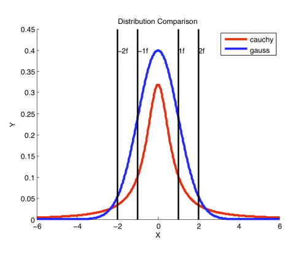

[](http://quantlet.de/)

## [](http://quantlet.de/) **MVAgausscauchy** [](http://quantlet.de/)

```yaml

Name of QuantLet: MVAgausscauchy

Published in: Applied Multivariate Statistical Analysis

Description: Demonstrates the differences of the pdf curves of a standard Gaussian distribution and a Cauchy distribution with location parameter mu = 0 and scale parameter sigma = 1.

Keywords: plot, graphical representation, cauchy, normal, pdf, density, distribution, standard-normal, gaussian

See also: MVAcltbern, MVAcltbern2, MVAcauchy, MVAtdis

Author: Wolfgang K. Haerdle

Submitted: Wed, September 07 2011 by Awdesch Melzer
Submitted[Matlab]: Wed, November 23 2016 by Lily Medina

```




### MATLAB Code
```matlab

%% clear variables and close windows
clear all
close all
clc

%% set input
seq    = -6:0.02:6;
cauchy = seq*trnd(1,1); 
fhat   = 1./pi./(1 + cauchy.^2);
% Plot the Cauchy density
hold on
plot(seq, fhat, 'r', 'Linewidth',3);
ylim([0,0.45])
ylabel('Y');
xlabel('X');

%% Plot the standard normal density
plot(seq,normpdf(0,seq),'b','Linewidth',3);

line([-2,-2],[0,0.5],'Color','k', 'Linewidth',2)
line([-1,-1],[0,0.5],'Color','k', 'Linewidth',2)
line([1,1],[0,0.5],'Color','k', 'Linewidth',2)
line([2,2],[0,0.5],'Color','k', 'Linewidth',2)

text(-2,0.4,'-2f')
text(-1,0.4,'-1f')
text(1,0.4, '1f')
text(2,0.4, '2f')
legend('cauchy','gauss')

title('Distribution Comparison')
hold off

```

automatically created on 2018-05-28

### R Code
```r


# clear all variables
rm(list = ls(all = TRUE))
graphics.off()

# Plot the Cauchy density
plot(seq(-6, 6, 0.02), dcauchy(seq(-6, 6, 0.02), 0, 1), type = "l", ylim = c(0, 0.4), 
    ylab = "Y", xlab = "X", col = "red", lwd = 3, cex.lab = 2, cex.axis = 2)

# Plot the standard normal density
lines(seq(-6, 6, 0.02), dnorm(seq(-6, 6, 0.02)), type = "l", ylim = c(0, 0.4), col = "blue", 
    lwd = 3)

abline(v = -2)
abline(v = -1)
abline(v = 1)
abline(v = 2)

text(-2, 0.4, label = "-2f")
text(-1, 0.4, label = "-1f")
text(1, 0.4, label = "1f")
text(2, 0.4, pos = 4, label = "2f")

legend(x = 4, y = 0.3, legend = c("Gauss", "Cauchy"), pch = c(20, 20), col = c("blue", 
    "red"), bty = "n")

title("Distribution Comparison")

```

automatically created on 2018-05-28