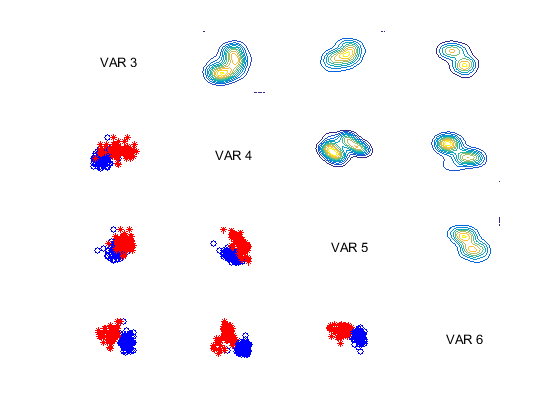
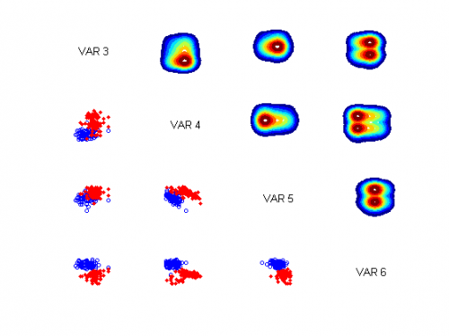

[](http://quantlet.de/)

## [](http://quantlet.de/) **MVAdraftbank4** [](http://quantlet.de/)

```yaml

Name of QuantLet: MVAdraftbank4

Published in: Applied Multivariate Statistical Analysis

Description: Computes a Draftman Plot for columns 3, 4, 5 and 6 of the Swiss bank notes data.

Keywords: contour, data visualization, density, empirical, graphical representation, plot, scatterplot

See also: MVAdrafthousing, MVAdrafthousingt

Author: Julia Wandke

Submitted: Tue, September 09 2014 by Awdesch Melzer
Submitted[Matlab]: Fri, December 02 2016 by Lily Medina

Datafiles: bank2.dat

```






### R Code
```r


# clear variables and close windows
rm(list = ls(all = TRUE))
graphics.off()

# install and load packages
libraries = c("KernSmooth")
lapply(libraries, function(x) if (!(x %in% installed.packages())) {
install.packages(x)
})
lapply(libraries, library, quietly = TRUE, character.only = TRUE)

# load data
data = read.table("bank2.dat")
x = data

i = 2
op = par(mfrow = c(4, 4), cex = 0.2)
while (i < 6) {
    i = i + 1
    j = 2
    while (j < 6) {
        j = j + 1
        if (i == j) {
            plot(i, type = "n", axes = FALSE, xlab = "", ylab = "", main = i, cex.main = 5)
        }
        if (i < j) {
            xx = cbind(x[, i], x[, j], c(rep(0, 100), rep(1, 100)))
            zz = bkde2D(xx[, -3], 0.4)
            contour(zz$x1, zz$x2, zz$fhat, nlevels = 12, col = rainbow(20), drawlabels = FALSE, 
                xlab = "X", ylab = "Y")
        }
        if (i > j) {
            yy = cbind(x[, i], x[, j], c(rep(0, 100), rep(1, 100)))
            plot(yy[, -3], pch = as.numeric(yy[, 3]), xlab = "X", ylab = "Y", cex = 3, 
                col = "blue")
        }
    }
}
par(op)
```

automatically created on 2018-05-28

### MATLAB Code
```matlab

%% clear variables and close windows
close all 
clear
clc

%% load data
x     = load('bank2.dat');
x3456 = x(:,3:6);

%% plot
for i = 1:4

    for j = 1:i-1
        
        subplot(4,4,(i-1)*4+j)
        plot(x3456(1:100,i),x3456(1:100,j),'ob','MarkerSize',4);
        hold on
        plot(x3456(101:200,i),x3456(101:200,j),'*r','MarkerSize',4);
        axis off

    end
        

    for j = i+1:4
      
        subplot(4,4,(i-1)*4+j)
        xi1 = x3456(:,i);
        xi2 = x3456(:,j);
        xi = [xi1 xi2];
        ksdensity(xi,'PlotFcn','contour') % it requires Matlab 2016
        axis off
        
    end

end

subplot(4,4,1)
axis off
text(0.3,0.5,'VAR 3')
subplot(4,4,6)
axis off
text(0.3,0.5,'VAR 4')

subplot(4,4,11)
axis off
text(0.3,0.5,'VAR 5')

subplot(4,4,16)
axis off
text(0.3,0.5,'VAR 6')

hold off

```

automatically created on 2018-05-28