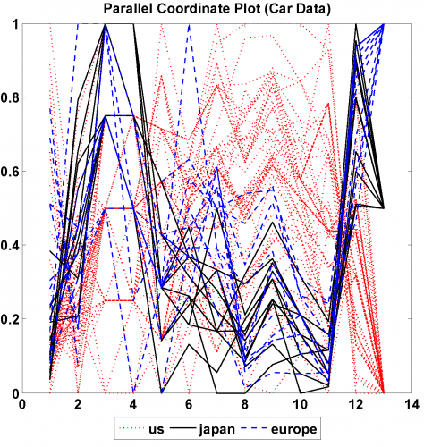

[](http://quantlet.de/)

## [](http://quantlet.de/) **MVApcp1** [](http://quantlet.de/)

```yaml

Name of QuantLet: MVApcp1

Published in: Applied Multivariate Statistical Analysis

Description: Computes parallel coordinates plot for car data.

Keywords: pcp, parallel-coordinates-plot, financial, data visualization, plot, graphical representation

See also: MVApcphousing, MVApcp2, MVApcp3, MVApcp4, MVApcp5, MVApcp6, MVApcp7, MVApcp8 

Author: Ji Cao, Song Song, Vladimir Georgescu, Awdesch Melzer

Submitted: Tue, September 09 2014 by Awdesch Melzer
Submitted[Matlab]: Thu, November 17 2016 by Lily Medina

Datafile: carc.txt

```




### MATLAB Code
```matlab

%% clear all variables
clear
close all
clc

%% load data
x     = load('carc.txt');
frame = x;
n     = size(frame,1);

%% standarize data
minf  = ones(n,1)*min(frame); % matrix of min values
maxf  = ones(n,1)*max(frame); % matrix of max values
equal = ones(n,1)*(max(frame)==min(frame)); %  equals 1 if true so that denominator is never equal zero

frame = (frame - minf)./(maxf - minf + equal);

%% plot
k = 0;
l = 0;
m = 0;

for i = 1:length(x)
    if x(i,13) == 1
        k = k + 1;
        us(k,:) = frame(i,:);
    
    elseif x(i,13) == 2
            l = l + 1;
            japan(l,:) = frame(i,:);
      
        elseif x(i,13) == 3
                m = m + 1;
                europe(m,:) = frame(i,:);
    end
end

hold on

p1 = plot(us','linewidth',1,'Color','r','LineStyle',':')
p2 = plot(japan','linewidth',1,'Color','k','LineStyle','-')
p3 = plot(europe','linewidth',1,'Color','b','LineStyle','--')
title('Parallel Coordinate Plot (Car Data)')

P1 = hggroup;
P2 = hggroup;
P3 = hggroup;

set(p1,'Parent',P1)
set(p2,'Parent',P2)
set(p3,'Parent',P3)

set(get(get(P1,'Annotation'),'LegendInformation'),...
    'IconDisplayStyle','on') % Include this hggroup in the legend
set(get(get(P2,'Annotation'),'LegendInformation'),...
    'IconDisplayStyle','on') % Include this hggroup in the legend
set(get(get(P3,'Annotation'),'LegendInformation'),...
    'IconDisplayStyle','on') % Include this hggroup in the legend

legend('us','japan','europe','Location','SouthOutside','Orientation','horizontal')
hold off
```

automatically created on 2018-05-28

### R Code
```r


# clear all variables
rm(list = ls(all = TRUE))
graphics.off()

# install and load packages
libraries = c("MASS")
lapply(libraries, function(x) if (!(x %in% installed.packages())) {
    install.packages(x)
})
lapply(libraries, library, quietly = TRUE, character.only = TRUE)

# load data
x = read.table("carc.txt")

d = x[, 13]
s = x[, 13]
d[c(x[, 13] == 1)] = 3
d[c(x[, 13] == 2)] = 1
d[c(x[, 13] == 3)] = 2
s[c(x[, 13] == 1)] = 2
s[c(x[, 13] == 2)] = 1
s[c(x[, 13] == 3)] = 4

# Plot
ir = rbind(x[, , 1], x[, , 2], x[, , 3], x[, , 4], x[, , 5], x[, , 6], x[, , 7], 
    x[, , 8], x[, , 9], x[, , 10], x[, , 11], x[, , 12], x[, , 13])
parcoord(log(ir)[, seq(1, 13, 1)], lty = d, lwd = 1, col = s, main = "Parallel Coordinates Plot (Car Data)", 
    frame = TRUE)
axis(side = 2, at = seq(0, 1, 0.2), labels = seq(0, 1, 0.2))
legend("bottom", c("us", "japan", "europe"), col = c(2, 1, 4), lty = c(3, 1, 2), 
    horiz = TRUE, cex = 0.6) 


```

automatically created on 2018-05-28