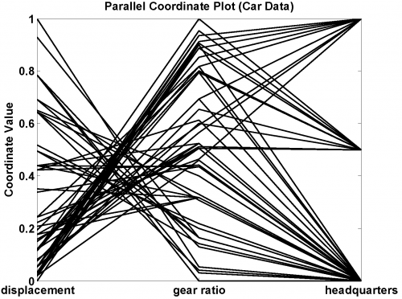

[](http://quantlet.de/)

## [](http://quantlet.de/) **MVApcp4** [](http://quantlet.de/)

```yaml

Name of QuantLet: MVApcp4

Published in: Applied Multivariate Statistical Analysis

Description: Computes parallel coordinates plot for variables displacement, gear ratio for high gear and company headquarters of the car data set.

Keywords: pcp, parallel-coordinates-plot, financial, data visualization, plot, graphical representation

See also: MVApcphousing, MVApcp1, MVApcp2, MVApcp3, MVApcp5, MVApcp6, MVApcp7, MVApcp8

Author: Ji Cao, Vladimir Georgescu, Awdesch Melzer, Song Song

Submitted: Tue, September 09 2014 by Awdesch Melzer
Submitted[Matlab]: Thu, November 17 2016 by Lily Medina

Datafile: carc.txt

```




### MATLAB Code
```matlab

%% clear all variables
clear
close all
clc

%% load data
x     = load('carc.txt');
frame = x(:,11:13); % extracts column 11 to 13 
n     = size(frame,1);

%% standarize data
minf  = ones(n,1)*min(frame); % matrix w. 3 columns: [min(displacement),min(gear ratio),min(headquarters)]
maxf  = ones(n,1)*max(frame); % matrix w. 3 columns: [max(displacement),max(gear ratio),max(headquarters)]
equal = ones(n,1)*(max(frame)==min(frame)); %  equals 1 if true so that denominator is never equal zero

frame = (frame - minf)./(maxf - minf + equal);

%% plot
label = {'displacement','gear ratio','headquarters'}
parallelcoords(frame,'linewidth',1.5, 'label', label,'Color','k')
title('Parallel Coordinate Plot (Car Data)')

```

automatically created on 2018-05-28

### R Code
```r


# clear all variables
rm(list = ls(all = TRUE))
graphics.off()

# install and load packages
libraries = c("MASS")
lapply(libraries, function(x) if (!(x %in% installed.packages())) {
    install.packages(x)
})
lapply(libraries, library, quietly = TRUE, character.only = TRUE)

# load data
x = read.table("carc.txt")
frame = data.frame(x[, 11:13])
colnames(frame) = c("displacement", "gear ratio", "headquarters")

# Plot
parcoord(log(frame[, c(1, 2, 3)]), frame = TRUE, main = "Parallel Coordinates Plot (Car Data)")
axis(side = 2, at = seq(0, 1, 0.2), labels = seq(0, 1, 0.2)) 

```

automatically created on 2018-05-28