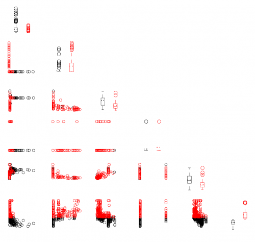

[](http://quantlet.de/)

## [](http://quantlet.de/) **MVAdrafthousing** [](http://quantlet.de/)

```yaml

Name of QuantLet: MVAdrafthousing

Published in: Applied Multivariate Statistical Analysis

Description: Plots the scatterplot matrix for Boston housing data.

Keywords: financial, data visualization, boxplot, scatterplot, plot, graphical representation

See also: MVAdrafthousingt, MVApcphousing

Author: Vladimir Georgescu, Jorge Patron, Song Song, Julia Wandke, Awdesch Melzer

Submitted: Tue, September 09 2014 by Awdesch Melzer
Submitted[Matlab]: Tue, November 22 2016 by Lily Medina

Datafile: bostonh.dat

```




### MATLAB Code
```matlab

%% clear all variables
close all 
clear
clc

%% load data
x = load('bostonh.dat');   
y = x(:,1:5);

for i = 1:length(x)
    y(i,6) = x(i,14);
end

med = median(y(:,6));

k = 1;
l = 1;
for i = 1:length(y)
    if y(i,6)<med
        y1(k,:) = y(i,:);
        k       = k+1;
    else
        y2(l,:) = y(i,:);
        l       = l+1;
    end
end

for i = 2:6
    for j = 1:i-1 
        subplot(6,6,(i-1)*6+j)
        plot(y1(:,j),y1(:,i),'ok','MarkerSize',5)
        hold on
        plot(y2(:,j),y2(:,i),'or','MarkerSize',5)
        axis off
    end
end
hold off

%Creating two vectors with the values of the 
%variable 'X1' higher and respectively lower than the median

k = 1;
l = 1;
for i = 1:length(y)
    if y(i,6)<med
        low1(k) = y(i,1);
        k       = k+1;   
    else
        hi1(l) = y(i,1);
        l      = l+1;
    end
end


%Plotting the boxplots for values<median, values>median respectively

low1 = low1';
hi1  = hi1'; 

subplot(6,6,1)
hold on
auxhi1  = ones(length(low1),1).*NaN;
boxplot([low1 auxhi1],'Symbol','o','Color','k')
line([0.85 1.15],[mean(low1) mean(low1)],'Color','k','LineStyle',':','LineWidth',1.2)
auxlow1 = ones(length(hi1),1).*NaN;
boxplot([auxlow1 hi1],'Symbol','o','Color','r')
line([1.85 2.15],[mean(hi1) mean(hi1)],'Color','r','LineStyle',':','LineWidth',1.2)
ylim([2*min(low1) 4*max(hi1)])
hold off
axis off

%Creating two vectors with the values of the variable 'X2' higher and  
%repectively lower than the median

k = 1;
l = 1;
for i = 1:length(y)
    if y(i,6)<med
        low2(k) = y(i,2);
        k       = k + 1;   
    else
        hi2(l) = y(i,2);
        l      = l + 1;
    end
end


%Plotting the boxplots for values<median, values>median respectively

low2 = low2';
hi2  = hi2'; 

subplot(6,6,8)
hold on
auxhi2 = ones(length(low2),1).*NaN;
boxplot([low2 auxhi2],'Symbol','o','Color','k')
line([0.85 1.15],[mean(low2) mean(low2)],'Color','k','LineStyle',':','LineWidth',1.2)
auxlow2 = ones(length(hi2),1).*NaN;
boxplot([auxlow2 hi2],'Symbol','o','Color','r')
line([1.85 2.15],[mean(hi2) mean(hi2)],'Color','r','LineStyle',':','LineWidth',1.2)
ylim([min(low2) max(hi2)])
hold off
axis off

%Creating two vectors with the values of the 
%variable 'X3' higher and repectively lower than the median

k = 1;
l = 1;
for i = 1:length(y)
    if y(i,6)<med
        low3(k) = y(i,3);
        k       = k + 1;   
    else
        hi3(l) = y(i,3);
        l      = l + 1;
    end
end


%Plotting the boxplots for values<median, values>median respectively

low3 = low3';
hi3  = hi3'; 

subplot(6,6,15)
hold on
auxhi3  = ones(length(low3),1).*NaN;
boxplot([low3 auxhi3],'Symbol','o','Color','k')
line([0.85 1.15],[mean(low3) mean(low3)],'Color','k','LineStyle',':','LineWidth',1.2)
auxlow3 = ones(length(hi3),1).*NaN;
boxplot([auxlow3 hi3],'Symbol','o','Color','r')
line([1.85 2.15],[mean(hi3) mean(hi3)],'Color','r','LineStyle',':','LineWidth',1.2)
ylim([0.1*min(low3) 1.5*max(hi3)])
hold off
axis off

%Creating two vectors with the values of the 
%variable 'X4' higher and repectively lower than the median

k = 1;
l = 1;
for i = 1:length(y)
    if y(i,6)<med
        low4(k) = y(i,4);
        k       = k + 1;   
    else
        hi4(l) = y(i,4);
        l      = l + 1;
    end
end


%Plotting the boxplots for values<median, values>median respectively

low4 = low4';
hi4  = hi4'; 

subplot(6,6,22)
hold on
auxhi4  = ones(length(low4),1).*NaN;
boxplot([low4 auxhi4],'Symbol','o','Color','k')
line([0.85 1.15],[mean(low4) mean(low4)],'Color','k','LineStyle',':','LineWidth',1.2)
auxlow4 = ones(length(hi4),1).*NaN;
boxplot([auxlow4 hi4],'Symbol','o','Color','r')
line([1.85 2.15],[mean(hi4) mean(hi4)],'Color','r','LineStyle',':','LineWidth',1.2)
ylim([min(low4) max(hi4)])
hold off
axis off

%Creating two vectors with the values of the 
%variable 'X5' higher and repectively lower than the median

k = 1;
l = 1;
for i = 1:length(y)
    if y(i,6)<med
        low5(k) = y(i,5);
        k       = k + 1;   
    else
        hi5(l) = y(i,5);
        l      = l + 1;
    end
end

%Plotting the boxplots for values<median, values>median respectively

low5 = low5';
hi5  = hi5'; 

subplot(6,6,29)
hold on
auxhi5  = ones(length(low5),1).*NaN;
boxplot([low5 auxhi5],'Symbol','o','Color','k')
line([0.85 1.15],[mean(low5) mean(low5)],'Color','k','LineStyle',':','LineWidth',1.2)
auxlow5 = ones(length(hi5),1).*NaN;
boxplot([auxlow5 hi5],'Symbol','o','Color','r')
line([1.85 2.15],[mean(hi5) mean(hi5)],'Color','r','LineStyle',':','LineWidth',1.2)
ylim([min(low5) 1.2*max(hi5)])
hold off
axis off

%Creating two vectors with the values of the 
%variable 'X14' higher and repectively lower than the median

k = 1;
l = 1;
for i = 1:length(y)
    if y(i,6)<med
        low14(k) = y(i,6);
        k        = k + 1;   
    else
        hi14(l) = y(i,6);
        l       = l + 1;
    end
end

%Plotting the boxplots for values<median, values>median respectively

low14 = low14';
hi14  = hi14'; 

subplot(6,6,36)
hold on

auxhi14  = ones(length(low14),1).*NaN;
boxplot([low14 auxhi14],'Symbol','o','Color','k')
line([0.85 1.15],[mean(low14) mean(low14)],'Color','k','LineStyle',':','LineWidth',1.2)

auxlow14 = ones(length(hi14),1).*NaN;
boxplot([auxlow14 hi14],'Symbol','o','Color','r')
line([1.85 2.15],[mean(hi14) mean(hi14)],'Color','r','LineStyle',':','LineWidth',1.2)
ylim([min(low14) max(hi14)])

hold off
axis off
```

automatically created on 2018-05-28

### R Code
```r


# clear all variables
rm(list = ls(all = TRUE))
graphics.off()

# load data
data = read.table("bostonh.dat")

K    = as.numeric(data[, 14] > median(data[, 14])) + 1
x    = cbind(data[, -(6:13)], K)
z    = data.frame(x)
z1   = subset(z, z$K == 1)
z2   = subset(z, z$K == 2)
m1   = apply(z1, 2, mean)
m2   = apply(z2, 2, mean)
i    = 0
op   = par(mfrow = c(6, 6), cex = 0.15)

while (i < 6) {
    i = i + 1
    j = 0
    while (j < 6) {
        j = j + 1
        
        if (i == j) {
            boxplot(x[, i] ~ K, at = 1:2, axes = FALSE, lwd = 0.7)
            lines(c(0.6, 1.4), c(m1[i], m1[i]), lty = "dotted", lwd = 1.2, col = "red3")
            lines(c(1.6, 2.4), c(m1[i], m1[i]), lty = "dotted", lwd = 1.2, col = "red3")
        }
        
        if (i > j) {
            yy = cbind(x[, j], x[, i], K)
            plot(yy[, -3], col = as.numeric(K), xlab = "", ylab = "", cex = 4, axes = FALSE)
        }
        
        if (i < j) {
            plot(i, type = "n", axes = FALSE, xlab = "", ylab = "", main = "")
        }
    }
}
title(main = list("Scatterplot matrix for Boston Housing", cex = 8), line = -16, 
    outer = TRUE) 

```

automatically created on 2018-05-28