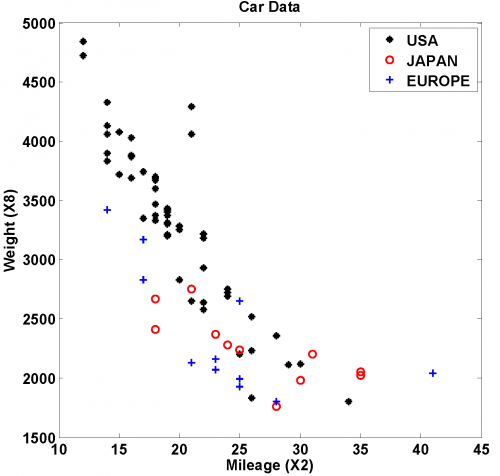

[](http://quantlet.de/)

## [](http://quantlet.de/) **MVAscacar** [](http://quantlet.de/)

```yaml

Name of QuantLet: MVAscacar

Published in: Applied Multivariate Statistical Analysis

Description: Computes a two dimensional scatterplot of mileage and weight from the car data set.

Keywords: data visualization, graphical representation, scatterplot, financial, plot, sas

See also: MVAcorrnorm, MVAregbank, MVAregpull, MVAscabank45, MVAscabank56, MVAscabank456, MVAscapull1, MVAscapull2, MVAdraftbank4, MVAdrafthousing, MVAdrafthousingt

Author: Vladimir Georgescu, Jorge Patron, Song Song
Author[SAS]: Svetlana Bykovskaya

Submitted: Mon, September 15 2014 by Awdesch Melzer
Submitted[SAS]: Wen, April 6 2016 by Svetlana Bykovskaya
Submitted[Matlab]: Tue, November 22 2016 by Lily Medina

Datafile: carc.txt, carc_sas.txt

```




### MATLAB Code
```matlab

%% clear all variables
clear
clc
close all

%% load data
x = load('carc.txt');
M = x(:, 2);
W = x(:, 8);
C = x(:, 13);

%% plot
gscatter(M,W,C,'krb','*o+',8)       % scatterplot of mileage vs weight grouping by country
title('Car Data')
xlabel('Mileage (X2)')
ylabel('Weight (X8)')
h = legend('USA','JAPAN','EUROPE',1); % the #1 controls for the position of the legend
set(h,'Interpreter','none')         % sets the legend on the plot
```

automatically created on 2018-05-28

### R Code
```r


# clear all variables
rm(list = ls(all = TRUE))
graphics.off()

# install and load packages
libraries = c("lattice")
lapply(libraries, function(x) if (!(x %in% installed.packages())) {
    install.packages(x)
})
lapply(libraries, library, quietly = TRUE, character.only = TRUE)

# load data
x = read.table("carc.txt")

M = x[, 2]
W = x[, 8]
C = x[, 13]

# point definition
D = C
D[x[, 13] == 2] = 1
D[x[, 13] == 1] = 8

# color definition
P = C
P[x[, 13] == 3] = 4
P[x[, 13] == 2] = 2
P[x[, 13] == 1] = 1

leg = c(8, 1, 3)

# plot
xyplot(W ~ M, pch = D, col = P, xlab = "Mileage (X2)", ylab = "Weight (X8)", main = "Car Data")

```

automatically created on 2018-05-28

### SAS Code
```sas


* Import the data;
data carc;
  infile '/folders/myfolders/Sas-work/data/carc_sas.txt';
  input t1 $ t2 $ t3 $ t4 $ t5 $ t6 $ t7 $ t8 $ t9 $ t10 $ t11 $ t12 $ t13 $;
  M = input(t2, 8.);
  W = input(t8, 8.);
  C = input(t13, 8.);
  drop t1--t13;
run;

proc sgplot data = carc
    noautolegend;
  title 'Car Data';
  scatter x = M y = W / colorresponse = C colormodel = (black red blue);
  xaxis label = 'Mileage (X2)';
  yaxis label = 'Weight (X8)';
run;

```

automatically created on 2018-05-28