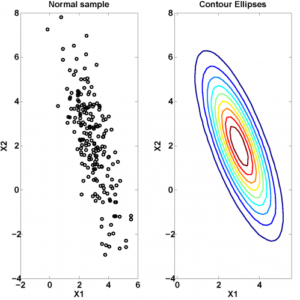

[](http://quantlet.de/)

## [](http://quantlet.de/) **MVAcontnorm** [](http://quantlet.de/)

```yaml

Name of QuantLet: MVAcontnorm

Published in: Applied Multivariate Statistical Analysis

Description: 'Computes a scatterplot of a normal sample and the contour ellipses for mu =(3,2) and sigma = (1,-1.5)~(-1.5,4).'

Keywords: bivariate, graphical representation, contour, normal-distribution, plot, scatterplot

See also: MVAcontbank2, MVAdenbank2, MVAdenbank3, MVAscabank45, MVAscabank56, MVAscacar, MVAscapull1, MVAscapull2

Author: Franziska Schulz, Maria Osipenko

Submitted: Mon, February 09 2015 by Lukas Borke
Submitted[Matlab]: Tue, November 22 2016 by Lily Medina

```




### R Code
```r


# clear variables and close windows
rm(list = ls(all = TRUE))
graphics.off()

# install and load packages
libraries = c("MASS", "mnormt")
lapply(libraries, function(x) if (!(x %in% installed.packages())) {
install.packages(x)
})
lapply(libraries, library, quietly = TRUE, character.only = TRUE)

# parameter settings
n   = 200  # number of draws
mu  = c(3, 2)  # mean vector
sig = matrix(c(1, -1.5, -1.5, 4), ncol = 2)  # covariance matrix

# bivariate normal sample
set.seed(80)
y = mvrnorm(n, mu, sig, 2)

# bivariate normal density
xgrid = seq(from = (mu[1] - 3 * sqrt(sig[1, 1])), to = (mu[1] + 3 * sqrt(sig[1, 1])), 
    length.out = 200)
ygrid = seq(from = (mu[2] - 3 * sqrt(sig[2, 2])), to = (mu[2] + 3 * sqrt(sig[2, 2])), 
    length.out = 200)
z     = outer(xgrid, ygrid, FUN = function(xgrid, ygrid) {
    dmnorm(cbind(xgrid, ygrid), mean = mu, varcov = sig)
})

# Plot
par(mfrow = c(1, 2))
plot(y, col = "black", ylab = "X2", xlab = "X1", xlim = range(xgrid), ylim = range(ygrid))
title("Normal sample")

# Contour ellipses
contour(xgrid, ygrid, z, xlim = range(xgrid), ylim = range(ygrid), nlevels = 10, col = c("blue", 
    "black", "yellow", "cyan", "red", "magenta", "green", "blue", "black"), lwd = 3, 
    cex.axis = 1, xlab = "X1", ylab = "X2")
title("Contour Ellipses")

```

automatically created on 2018-05-28

### MATLAB Code
```matlab

%%clear all variables 
clear all
close all
clc

%% input parameters
n   = 200;
mu  = [3 2];
sig = [1   -1.5 ; -1.5  4];

[vector,value] = eig(sig); %Calculate Eigenvalues and Eigenvectors
ll = sqrt(value);
sh = vector*ll*vector';

nr = normrnd(0,1,n,size(sig,1));
y  = nr*sh';

for i = 1:length(sig)
    y(:,i) = y(:,i)+mu(i);
end

%% plot
hold on
subplot(1,2,1)
scatter(y(:,1),y(:,2),25,'k')
title('Normal sample')
xlabel('X1')
ylabel('X2')

%Contour ellipses
subplot(1,2,2)
ymin   = min(y);
yrange = max(y)-min(y);

ng(:,1:2) = 30;


% Constructing the grid
d    = yrange./(ng-1);
min1 = ymin(1,1);
m1   = min1;
min2 = ymin(1,2);
m2   = min2;


grid(1,1) = min1;
grid(1,2) = min2;

for i = 1:900
    
    if mod(i-1,30)==0
        min1      = m1;
        grid(i,1) = m1;
    else
        grid(i,1) = min1+d(1,1);
        min1      = min1+d(1,1);
    end;
    
    if mod(i-1,30)==0
        min2      = min2+d(1,2);
        grid(i,2) = min2;
    else
        grid(i,2) = min2;
    end;
    
end;

scatter(grid(:,1),grid(:,2));
for i=1:2
    diff(:,i) = (grid(:,i)-mu(i));
end
ff = diff*inv(sig);
ff = ff.*diff;
for i = 1:length(ff)
    f1(i) = -(ff(i,1)+ff(i,2));
end
f2=exp(f1/2);

f = f2/sqrt(det(2*pi*sig));

g = [grid,f'];

% Plotting the contours
j = 1;
k = 1;
for i = 1:900
    xx(j,k) = g(i,2);
    j       = j + 1;
    if mod(i,30)==0
        j = 1;
        k = k + 1;
    end
end

j = 1;
k = 1;
for i = 1:900
    yy(j,k) = g(i,1);
    j       = j + 1;
    if mod(i,30) == 0
        j = 1;
        k = k+1;
    end
end

j = 1;
k = 1;
for i = 1:900
    zz(j,k) = g(i,3);
    j       = j + 1;
    if mod(i,30) == 0
        j = 1;
        k = k + 1;
    end
end

[C,h] = contour(xx,yy,zz,9);
title('Contour Ellipses')
xlabel('X2')
ylabel('X1')
view(90,-90)
hold off

```

automatically created on 2018-05-28