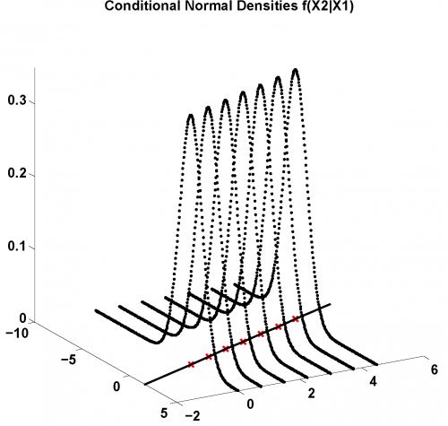

[](http://quantlet.de/)

## [](http://quantlet.de/) **MVAcondnorm** [](http://quantlet.de/)

```yaml

Name of QuantLet: MVAcondnorm

Published in: Applied Multivariate Statistical Analysis

Description: Computes conditional normal densities f(x2|x1) where the joint distribution has mean=(0|0) and cov=(1|-0.8)~(-0.8|2).

Keywords: conditional density, conditional distribution, conditional mean, density, joint distribution, normal-distribution, plot, graphical representation

Author: Maria Osipenko, Franziska Schulz

Submitted: Mon, February 09 2015 by Lukas Borke


```




### R Code
```r


# clear variables and close windows
rm(list = ls(all = TRUE))
graphics.off()

# install and load packages
libraries = c("scatterplot3d")
lapply(libraries, function(x) if (!(x %in% installed.packages())) {
install.packages(x)
})
lapply(libraries, library, quietly = TRUE, character.only = TRUE)

# input parameters
Sigma = matrix(c(1, -0.8, -0.8, 2), 2, 2)                            # Covariance matrix of the Bivariate Normal distribution
c = sqrt(Sigma[2, 2] - Sigma[2, 1] * 1/(Sigma[1, 1]) * Sigma[1, 2])  # SD of conditional f(X2|X1)

# Create grid for x1,x2 and compute conditional pdf

x1  = rep(seq(0, 4.5, by = 0.75), times = 301)                # grid values for x1\t\t
x2  = rep(seq(-10, 5, by = 0.05), each = length(unique(x1)))  # grid values for x2
f   = dnorm(0, (x2 - Sigma[1, 1]/Sigma[1, 2] * x1)/c, 1)/c    # conditional pdf f(X2|X1)
xx1 = cbind(x1, x2, f)

# Conditional means
xm  = unique(x1)                                              # realized x1
m   = cbind(xm, Sigma[2, 1] * xm, rep(0, length(xm)))         # conditional mean
xmf = c(-2, xm, 6)

# plot: shifts in the conditional density
s3d = scatterplot3d(xx1[, 2], xx1[, 1], xx1[, 3], lwd = 0.05, pch = 20, ylab = "", 
    xlab = "", zlab = "", scale.y = 0.7, cex.axis = 1.1, angle = 40)
s3d$points3d(m[, 2], m[, 1], m[, 3], pch = 3, col = "red3", lwd = 2)
s3d$points3d(Sigma[2, 1] * xmf, xmf, rep(0, 9), type = "l", col = "black", lwd = 2)

title("Conditional Normal Densities f(X2|X1)")
```

automatically created on 2018-05-28

### MATLAB Code
```matlab

% ---------------------------------------------------------------------
% Book:         MVA
% ---------------------------------------------------------------------
% Quantlet:     MVAcondnorm
% ---------------------------------------------------------------------
% Description:  MVAcondnorm computes conditonal normal densities f(x2|x1) 
%               where the joint distribution has mean=(0|0) and
%               cov=(1|-0.8)~(-0.8|2).
%               Corresponds to Example 5.1 in MVA.
% ---------------------------------------------------------------------
% Usage:        -
% ---------------------------------------------------------------------
% Inputs:       None
% ---------------------------------------------------------------------
% Output:       Plot of the conditional mean of (x2|x1) and the shifted 
%               conditonal normal densities f(x2|x1). 
% ---------------------------------------------------------------------
% Example:      -
% ---------------------------------------------------------------------
% Author:       Wolfgang Haerdle, Vladimir Georgescu, Jorge Patron,
%               Song Song
% ---------------------------------------------------------------------

clear
clc
close all

c=sqrt(1.36);
k=0;
l=-10;
i=0;

while i<=2100
   i=i+1; 
   k=k+1;
   x(i,2)=l;
   if mod(k,7)==0 
       k=0;
       l=l+0.05;
   end
end

i=0;
l=0;
while i<=2100
   i=i+1; 
   x(i,1)=l;
   l=l+0.75;
   if mod(i,7)==0 
       l=0;
   end
end

f=normpdf(0,(x(:,2)+0.8*x(:,1))/c,1)/c;
x1=[x,f];

l=0;
i=1;

hold on

xlim([-2 6])
title('Conditional Normal Densities f(X2|X1)');
for k=1:7
        while l<2100    
            plot3(x1(i+l,1),x1(i+l,2),x1(i+l,3),'LineStyle','.','Color','k')
            l=l+7;
        end
        i=k+1;
        l=0;
        view(30,-20)
end

%Conditional means
xm=x(1:7,1);
m=[xm, -0.8*xm, zeros(7,1)];
xm1=-2;
xm2=6;
xmf=[xm1;xm;xm2];

%Line through conditional means
plot(m(:,1),m(:,2),'Marker','x','MarkerSize',10,'Color','r','LineWidth',2);
line(xmf,-0.8*xmf,'Color','k','LineWidth',2);

hold off
```

automatically created on 2018-05-28