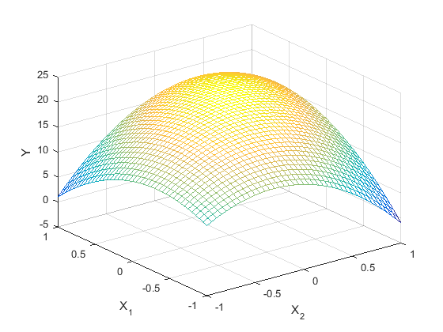
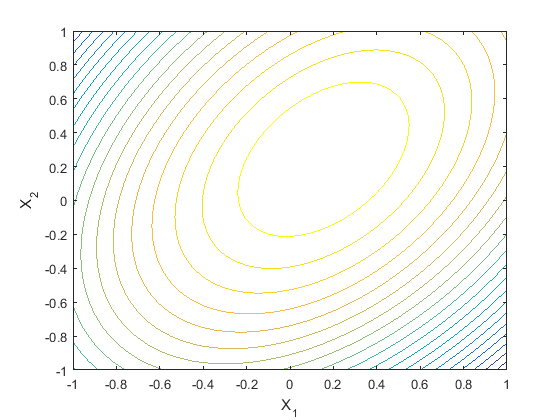
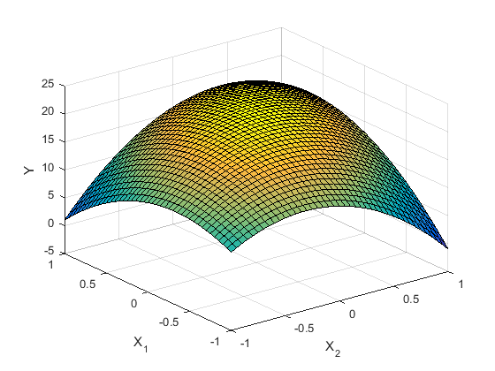

[](http://quantlet.de/)

## [](http://quantlet.de/) **MVAresponsesurface** [](http://quantlet.de/)

```yaml

Name of QuantLet: MVAresponsesurface

Published in: Applied Multivariate Statistical Analysis

Description: Plots 3D response surfaces and a contour plot for the variable y and the two factors that explain the variation of y via the quadratic response model.

Keywords: 3D, surface, contour, plot, graphical representation, response-model, regression

See also: MVAdrug

Author: Awdesch Melzer
Author[Matlab]: Wolfgang Haerdle

Submitted: Wed, April 04 2012 by Dedy Dwi Prastyo
Submitted[Matlab]: Thu, December 08 2016 by Piedad Castro

```








### MATLAB Code
```matlab

%% clear all variables and console and close windows
clear
clc
close all

%% Define x1 and x2 between [-1:1].
x1       = (-1:0.05:1)'; 
[n1, p1] = size(x1);
x2       = (-1:0.05:1)';
[n2, p2] = size(x2);

b = [20 1 2 -8 -6  6]';     %Set beta
L = [];

%% Compute y
for i = 1:n1
    xi   = x1(i);
    temp = [];
    for j = 1:n2
        xj   = x2(j);
        Lij  = b(1) + b(2) * xi + b(3) * xj + b(4) * xi^2 + b(5) * xj^2 + b(6) * xi * xj; 
        temp = [temp Lij];
    end
    L = [L; temp];
end

%% Plot mesh grid
figure
mesh(x2, x1, L')
xlabel ('X_2')
ylabel('X_1')
zlabel('Y')

%% Plot contour lines
figure
contour(x1, x2, L', 20)
xlabel ('X_1')
ylabel('X_2')
zlabel('Y')

%% Plot x1 and x2 as surface
figure
surf(x2, x1, L')
xlabel ('X_2')
ylabel('X_1')
zlabel('Y')

```

automatically created on 2018-05-28

### R Code
```r


# clear variables and close windows
rm(list = ls(all = TRUE))
graphics.off()

# install and load packages
libraries = c("lattice")
lapply(libraries, function(x) if (!(x %in% installed.packages())) {
    install.packages(x)
})
lapply(libraries, library, quietly = TRUE, character.only = TRUE)

# Define x1 and x2 between [-1:1].
x1 = seq(-1, 1, 0.05)
n1 = length(x1)
x2 = seq(-1, 1, 0.05)
n2 = length(x2)

# Set beta
b = c(20, 1, 2, -8, -6, 6)

L = NULL
x = NULL

# Calculate y
for (i in 1:n1) {
    xi = x1[i]
    temp = NULL
    for (j in 1:n2) {
        xj = x2[j]
        Lij = b[1] + b[2] * xi + b[3] * xj + b[4] * xi^2 + b[5] * xj^2 + b[6] * xi * 
            xj
        temp = cbind(temp, Lij)
    }
    L = rbind(L, temp)
}

wireframe(L, drape = T, xlab = list("X2", rot = 30, cex = 1.2), main = expression(paste("3-D response surface")), 
    ylab = list("X1", rot = -40, cex = 1.2), zlab = list("Y", cex = 1.1), scales = list(arrows = FALSE, 
        col = "black", distance = 1, tick.number = 8, cex = 0.7, x = list(at = seq(1, 
            41, 5), labels = round(seq(-1, 1, length = 9), 1)), y = list(at = seq(1, 
            41, 5), labels = round(seq(-1, 1, length = 9), 1))))

dev.new()
contour(L, col = rainbow(15), xlab = "X1", ylab = "X2", main = expression(paste("Contour plot")), 
    ) 

```

automatically created on 2018-05-28