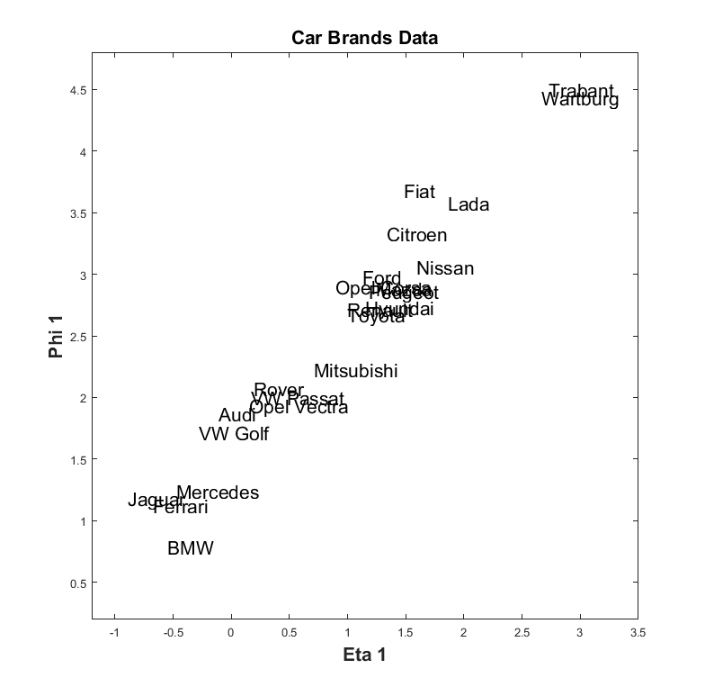
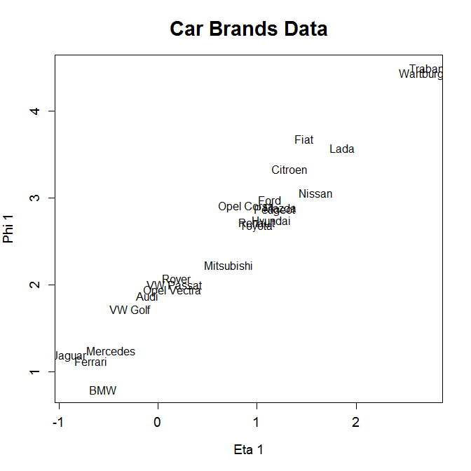

[](http://quantlet.de/)

## [](http://quantlet.de/) **MVAcancarm** [](http://quantlet.de/)

```yaml

Name of QuantLet: MVAcancarm

Published in: Applied Multivariate Statistical Analysis

Description: Performs a canonical correlation analysis for the car brands data and shows a plot of the first canonical variables.

Keywords: canonical, canonical-analysis, correlation, plot, graphical representation, canonical-parameter, covariance, covariance-matrix, svd, data visualization, sas

See also: MVAcanus, SMScancarm, SMScancarm1, SMScancarm2, SMScanfood, SMScanus

Author: Zografia Anastasiadou
Author[SAS]: Svetlana Bykovskaya
Author[Matlab]: Wolfgang Haerdle, Vladimir Georgescu, Jorge Patron, Song Song

Submitted: Fri, December 16 by Piedad Castro
Submitted[SAS]: Wed, April 06 2016 by Svetlana Bykovskaya
Submitted[Matlab]: Fri, December 16 by Piedad Castro

Datafile: carmean2.dat, carmean2_sas.dat

```






### MATLAB Code
```matlab

%% clear all variables and console and close windows
clear
clc
close all

%% load data
formatSpec = '%s%f%f%f%f%f%f%f%f';
data       = readtable('carmean2.dat', 'Format', formatSpec, 'ReadVariableNames', false);
cars1      = data;
cars1(:,1) = [];
cars1      = table2array(cars1);

%% Reordering the columns of the matrix
cars        = [cars1(:, 4), cars1(:, 3), cars1(:, 1:2), cars1(:, 5:8)];
s           = cov(cars);

sa          = s(1:2, 1:2);
sb          = s(3:8, 3:8);

[va1, ea1]  = eigs(sa);
[vb1, eb1]  = eigs(sb);
ea          = diag(ea1);
eb          = diag(eb1);
sa2         = va1 * diag(1./sqrt(ea)) * va1';
sb2         = vb1 * diag(1./sqrt(eb)) * vb1';

k           = sa2 * s(1:2,3:8) * sb2;
[g,l,d]     = svd(k);

a           = sa2 * g;
b           = sb2 * d;
eta         = cars(:, 1:2) * a(:, 1);
phi         = cars(:,3:8) * b(:, 1);
etaphi      = [eta, phi];
etaphi      = etaphi';

% labels
s = ['Audi       ';'BMW        ';'Citroen    ';'Ferrari    ';'Fiat       ';...
    'Ford       ';'Hyundai    ';'Jaguar     ';'Lada       ';'Mazda      ';...
    'Mercedes   ';'Mitsubishi ';'Nissan     ';'Opel Corsa ';'Opel Vectra';...
    'Peugeot    ';'Renault    ';'Rover      ';'Toyota     ';'Trabant    ';...
    'VW Golf    ';'VW Passat  ';'Wartburg   '];

%% plot
scatter(etaphi(1,:),etaphi(2,:),'.','w')
hold on
text(etaphi(1,:),etaphi(2,:),s,'FontSize',16)
title('Car Brands Data','FontSize',16,'FontWeight','Bold')
xlabel('Eta 1', 'FontSize', 16, 'FontWeight', 'Bold')
ylabel('Phi 1', 'FontSize', 16, 'FontWeight', 'Bold')
xlim([-1.2, 3.5])
ylim([0.2, 4.8])
box on

```

automatically created on 2018-05-28

### R Code
```r


# clear all variables
rm(list = ls(all = TRUE))
graphics.off()

# read data
cardat  = read.table("carmean2.dat")

# delete first column (names of the car marks)
car     = cardat[, -1]

# define variable names
colnames(car) = c("economy", "service", "value", "price", "design", "sporty", "safety", 
    "handling")

# define car brands
rownames(car) = c("Audi", "BMW", "Citroen", "Ferrari", "Fiat", "Ford", "Hyundai", 
    "Jaguar", "Lada", "Mazda", "Mercedes", "Mitsubishi", "Nissan", "Opel Corsa", 
    "Opel Vectra", "Peugeot", "Renault", "Rover", "Toyota", "Trabant", "VW Golf", 
    "VW Passat", "Wartburg")

# reordering the columns of the matrix
cars    = cbind(car[, 4:3], car[, 1:2], car[, 5:8])
s       = cov(cars)
sa      = s[1:2, 1:2]
sb      = s[3:8, 3:8]
eiga    = eigen(sa)
eigb    = eigen(sb)
sa2     = eiga$vectors %*% diag(1/sqrt(eiga$values)) %*% t(eiga$vectors)
sb2     = eigb$vectors %*% diag(1/sqrt(eigb$values)) %*% t(eigb$vectors)
k       = sa2 %*% s[1:2, 3:8] %*% sb2
si      = svd(k)
a       = sa2 %*% si$u
b       = sb2 %*% si$v
eta     = as.matrix(cars[, 1:2]) %*% a[, 1]
phi     = as.matrix(cars[, 3:8]) %*% b[, 1]
etaphi  = cbind(eta, phi)

# plot
plot(etaphi, type = "n", xlab = "Eta 1", ylab = "Phi 1", main = "Car Brands Data", 
    cex.lab = 1.2, cex.axis = 1.2, cex.main = 1.8)
text(etaphi, rownames(car))

```

automatically created on 2018-05-28

### SAS Code
```sas


* Import the data;
data carmean2;
  infile '/folders/myfolders/data/carmean2_sas.dat';
  input temp1 $ temp2-temp9;
run;

proc iml;
  * Read data into a matrix;
  use carmean2;
    read all var _ALL_ into x; 
  close carmean2;
  
  colnames = {"economy", "service", "value", "price", "design", "sporty", "safety", 
    "handling"}; 
  rownames = {"Audi", "BMW", "Citroen", "Ferrari", "Fiat", "Ford", "Hyundai", 
    "Jaguar", "Lada", "Mazda", "Mercedes", "Mitsubishi", "Nissan", "Opel Corsa", 
    "Opel Vectra", "Peugeot", "Renault", "Rover", "Toyota", "Trabant", "VW Golf", 
    "VW Passat", "Wartburg"};
  
  * reordering the columns of the matrix;
  cars = x[, 4:3] || x[, 1:2] || x[, 5:8];
  s    = cov(cars);
  sa   = s[1:2, 1:2];
  sb   = s[3:8, 3:8];
  sa2  = eigvec(sa) * diag(1/sqrt(eigval(sa))) * eigvec(sa)`;
  sb2  = eigvec(sb) * diag(1/sqrt(eigval(sb))) * eigvec(sb)`;
  k    = sa2 * s[1:2, 3:8] * sb2;
  
  call svd(u,q,v,k);
  a    = sa2 * u;
  b    = sb2 * v;
  eta  = cars[, 1:2] * a[, 1];
  phi  = cars[, 3:8] * b[, 1];
  
  create plot var {"eta" "phi" "rownames"};
    append;
  close plot;
quit;

proc sgplot data = plot
    noautolegend;
  title 'Car Marks Data';
  scatter x = eta y = phi / markerattrs = (color = blue symbol = circlefilled)
    datalabel = rownames;
  xaxis label = 'Eta 1';
  yaxis label = 'Phi 1';
run;

```

automatically created on 2018-05-28