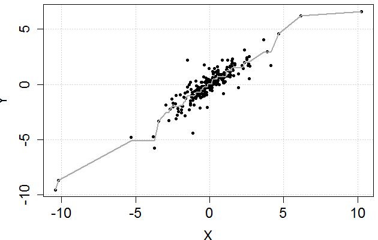

[](http://quantlet.de/)

## [](http://quantlet.de/) **PAVAlgo** [](http://quantlet.de/)

```yaml

Name of Quantlet:	PAVAlgo 

Published in: ''

Description: 'PAVAlgo applies the Pool-Adjacent-Violators Algorithm to an unordered data set and returns the solution. The function is applied to simulated data and the result is graphically illustrated'

Keywords: 'PAV, smoothing, PAV, bivariate, copula, estimation, interpolation, regression, scatterplot'

See also: MVAMDSpooladj

Author: Alexander Ristig, Chen Huang

Submitted: Wed, October 15 2014 by Franziska Schulz


```



### R Code
```r

# Clear variables and close windows

rm(list = ls(all = TRUE))
graphics.off()

# PVA algorithm as function

PAV = function(X, Y, FUN = mean, ..., left = TRUE, ordered = FALSE){
      n = length(Y)
      stopifnot(n > 1, n == length(X), !any(is.na(c(X, Y))))
      
      if(!ordered){
        .order = order(X); 
        Y = Y[.order]; X = X[.order]
      }
      
      Y.hat = Y; work.index = 1:n;
                    
      if(left){
           main.index = 1:(n-1)
           repeat{
              .increasing = (diff(Y.hat) < 0) # looking from the left to the right
              if(!any(.increasing)){
                  break
              }else{
                  i = min(main.index[.increasing])
                  .i.and.ii = work.index %in% work.index[i:(i + 1)]
                  Y.hat[.i.and.ii] = FUN(Y.hat[.i.and.ii], ...)
                  work.index[.i.and.ii] = work.index[i]
              }
           }
      }else{ 
           main.index = 2:n
           repeat{
              .decreasing = (diff(Y.hat) < 0) # looking from the right to the left
              if(!any(.decreasing)){
                  break
              }else{
                  i = max(main.index[.decreasing])
                  .i.and.ii = work.index %in% work.index[(i - 1):i]
                  Y.hat[.i.and.ii] = FUN(Y.hat[.i.and.ii], ...)
                  work.index[.i.and.ii] = work.index[i]
              }
           }
      }
      list(Y.hat = Y.hat, Y = Y, X = X)   
}

# Sample data from a bivariate t-distribution with df = 4

#install.packages("copula")
library("copula")
set.seed(1)
Data = apply(X = rCopula(250, tCopula(0.9, dim = 2)), 2, FUN = qt, df = 4);

result.left = PAV(Data[, 1], Data[, 2], FUN = mean)

# Scatterplot of simulated data
par(mai = c(0.9, 0.9, 0, 0) + 0.1, cex.axis = 1.5,  cex.lab = 1.5)
plot(Data, axes = FALSE, xlab = expression(X), ylab = expression(Y), pch = 20)
grid(lwd = 1.5)
points(result.left$X, result.left$Y, pch = 20, lwd = 1.75)
axis(1)
axis(2)
box(lwd = 1.5)

# Scatterplot of simulated data together with regression line
par(mai = c(0.9, 0.9, 0, 0) + 0.1, cex.axis = 1.5,  cex.lab = 1.5)
plot(result.left$X, result.left$Y, axes = FALSE, xlab = expression(X), ylab = expression(Y), pch = 20)
grid(lwd = 1.5)
points(result.left$X, result.left$Y, pch = 20, lwd = 1.75)
points(result.left$X, result.left$Y.hat, type = "l", pch = 20, lwd = 2.5, col = "darkgray")
axis(1)
axis(2)
box(lwd = 1.5)

```

automatically created on 2018-09-04

### MATLAB Code
```matlab

function [xhat, yhat] = PAVAlgo(x,y)  %Define the PVA algorithm as a function

for i = 1:length(x)
 data  = [x y];
 sdata = sortrows(data,1);  % Sort the bivariate data by the first variable
 xhat  = sdata(:,1);
 yhat  = sdata(:,2);
 for n = 1:length(x)-1 % checking from left to right
     if yhat(n) > yhat(n+1) 
        yhat(n:n+1) = mean(yhat(n:n+1))*ones(2,1); 
        p           = 0;
        while p < n-1 % checking from right to left 
        if yhat(n-p-1) > yhat(n-p) 
           yhat(n-p-1:n+1) = mean(yhat(n-p-1:n+1))*ones(p+3,1);  
           p               = p+1;
        else
            p = n-1;
        end
        end
     end  
 end
end

```

automatically created on 2018-09-04