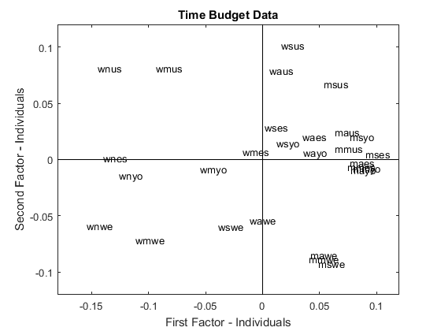
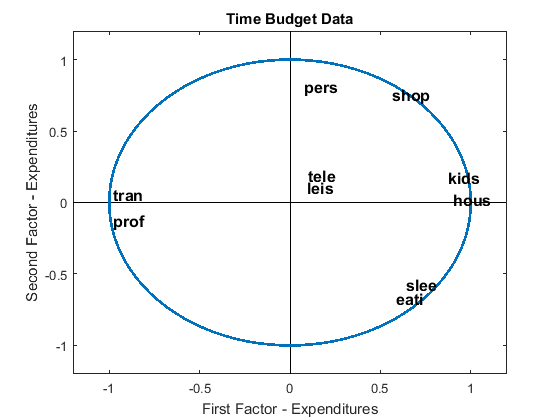

[](http://quantlet.de/)

## [](http://quantlet.de/) **MVAnpcatime** [](http://quantlet.de/)

```yaml

Name of QuantLet: MVAnpcatime

Published in: Applied Multivariate Statistical Analysis

Description: 'Performs a PCA for the standardized time 
budget data and shows the first two principal components 
for the individuals and the variables.'

Keywords: principal-components, pca, npca, eigenvalues, standardization, eigenvalue-decomposition, plot, graphical representation, data visualization, sas 

See also: MVAnpcabanki, MVAnpcahous, MVAnpcahousi, MVAnpcabank, MVAnpcafood, MVAnpcausco, MVAnpcausco2, MVAnpcausco2i, MVAcpcaiv, MVApcabank, MVApcabanki, MVApcabankr, MVApcasimu

Author: Zografia Anastasiadou, Awdesch Melzer
Author[SAS]: Svetlana Bykovskaya
Author[Matlab]: Jorge Patron, Vladimir Georgescu, Song Song

Submitted: Wed, April 02 2014 by Awdesch Melzer
Submitted[SAS]: Tue, April 05 2016 by Svetlana Bykovskaya
Submitted[Matlab]: Tue, December 13 2016 by Piedad Castro

Datafile: timebudget.dat

Example: 
- 1: Representation of the individuals.
- 2: Representation of the variables.

Note: 'Matlab and SAS decompose matrices differently than R, and therefore some 
      of the eigenvectors may have different signs.'

```







### MATLAB Code
```matlab

%% clear all variables and console and close windows
clear
clc
close all

%% load data
x1 = load('timebudget.dat');

[n,p] = size(x1);
m     = mean(x1);
x     = (x1-repmat(m,n,1)).*repmat(1./sqrt((n-1)*var(x1)),n,1); % standardizes Data


[v1,e1] = eigs((x*x')/n,n,'la'); % Decomposes matrix and sorts eigenvalues and vectors by size
e       = diag(e1);              % Creates column vector of eigenvalues
w(:,1)  = v1(:,1).*sqrt(e(1));
w(:,2)  = v1(:,2).*sqrt(e(2));

%% plot1, representation of the individuals
figure(1)
hold on
line([-0.18 0.12],[0 0],'Color','k')
line([0 0],[-0.12 0.12],'Color','k')
xlim([-0.18 0.12]);
ylim([-0.12 0.12]);
title('Time Budget Data');
xlabel('First Factor - Individuals');
ylabel('Second Factor - Individuals');
% labels of the individuals
fams = ['maus';'waus';'wnus';'mmus';'wmus';'msus';'wsus';'mawe';'wawe';
       'wnwe';'mmwe';'wmwe';'mswe';'wswe';'mayo';'wayo';'wnyo';'mmyo';
       'wmyo';'msyo';'wsyo';'maes';'waes';'wnes';'mmes';'wmes';'mses';
       'wses']; 
text(w(:,1), w(:,2), fams)
box on

[v2,e2] = eigs(x'*x,p,'la');
ee      = diag(e2);              % creates ector of eigenvalues
z(:,1)  = v2(:,1)*sqrt(ee(1));   % First PC
z(:,2)  = v2(:,2)*sqrt(ee(2));   % Second PC

%% plot2, representation of the variables
figure(2);
hold on
line([-1.2 1.2],[0 0],'Color','k')
line([0 0],[1.2 -1.2],'Color','k')
xlim([-1.2 1.2])
ylim([-1.2 1.2])
circle = rsmak('circle');
fnplt(circle);
title('Time Budget Data');
xlabel('First Factor - Expenditures')
ylabel('Second Factor - Expenditures')
% labels of the variables
namez = ['prof';'tran';'hous';'kids';'shop';'pers';'eati';'slee';'tele';
       'leis'];
text(z(:,1),z(:,2),namez,'FontSize',12,'FontWeight','bold');
box on
hold off

```

automatically created on 2018-05-28

### R Code
```r


# clear all variables
rm(list = ls(all = TRUE))
graphics.off()

# load data
x  = read.table("timebudget.dat")
n  = nrow(x)                            # number of rows
p  = ncol(x)                            # number of columns
x1 = sqrt((n - 1) * apply(x, 2, var))   # estimated std error for each variable
x2 = x - matrix(apply(as.matrix(x), 2, mean), nrow = n, ncol = p, byrow = T)  # X - mean(X)
x  = as.matrix(x2/matrix(x1, nrow = n, ncol = p, byrow = T))                  # Standardizes Data
e  = eigen(x %*% t(x)/n)                # Eigenvalues/Eigenvectors
e1 = e$values
e2 = e$vectors
a  = e2[, 1:2]                          # first two Eigenvectors corresponding to largest 2 Eigenvalues
w  = a * sqrt(matrix(e1[1:2], nrow(a), ncol(a), byrow = TRUE))                # coordinates of individuals

# Plot 1: the representation of the individuals
plot(w, type = "n", xlab = "First Factor - Individuals", ylab = "Second Factor - Individuals", 
    main = "Time Budget data", cex.lab = 1.2, cex.axis = 1.2, cex.main = 1.8, lwd = 2)
label = c("maus", "waus", "wnus", "mmus", "wmus", "msus", "wsus", "mawe", "wawe", 
    "wnwe", "mmwe", "wmwe", "mswe", "wswe", "mayo", "wayo", "wnyo", "mmyo", "wmyo", 
    "msyo", "wsyo", "maes", "waes", "wnes", "mmes", "wmes", "mses", "wses")
text(w, label, cex = 1.2)
abline(h = 0, v = 0)

g  = eigen(t(x) %*% x)  # Eigenvalues/Eigenvectors
g1 = g$values
g2 = g$vectors
b  = g2[, 1:2]          # first 2 vectors corresponding to largest 2 Eigenvalues
z  = b * sqrt(matrix(g1[1:2], nrow(b), ncol(b), byrow = TRUE))  # coordinates of variables
dev.new()

# Plot 2: the representation of the variables
ucircle = cbind(cos((0:360)/180 * pi), sin((0:360)/180 * pi))
plot(ucircle, type = "l", lty = "solid", col = "blue", xlab = "First Factor - Expenditures", 
    ylab = "Second Factor - Expenditures", main = "Time Budget data", cex.lab = 1.2, 
    cex.axis = 1.2, cex.main = 1.8, lwd = 2)
abline(h = 0, v = 0)
label = c("prof", "tran", "hous", "kids", "shop", "pers", "eati", "slee", "tele", 
    "leis")
text(z, label, cex = 1.2) 

```

automatically created on 2018-05-28

### SAS Code
```sas


* Import the data;
data timebudget;
  infile '/folders/myfolders/data/timebudget.dat';
  input temp1-temp10;
run;

proc iml;
  * Read data into a matrix;
  use timebudget;
    read all var _ALL_ into x; 
  close timebudget;
  
  n  = nrow(x); 
  p  = ncol(x);
  x  = (x - repeat(x(|:,|), n, 1)) / sqrt((n - 1) * var(x)); * standardizes the data;
  e  = x * x` / n;
  e1 = eigval(e);
  a  = eigvec(e)[, 1:2];  * first two Eigenvectors corresponding to largest 2 Eigenvalues;
  w  = a # sqrt(repeat(e1[1:2]`, nrow(a), 1)); *coordinates of individuals;
  
  g  = t(x) * x; 
  g1 = eigval(g);
  b  = eigvec(g)[, 1:2];  * first two Eigenvectors corresponding to largest 2 Eigenvalues;
  z  = b # sqrt(repeat(g1[1:2]`, nrow(b), 1)); *coordinates of variables;
  
  pi = constant("pi");
  uc = (cos((0:360)/180 * pi) // sin((0:360)/180 * pi))`;
  u1 = uc[,1];
  u2 = uc[,2];
  
  w1 = w[,1];
  w2 = w[,2];
  z1 = z[,1];
  z2 = z[,2];
  names1 = {"maus", "waus", "wnus", "mmus", "wmus", "msus", "wsus", "mawe", "wawe", 
    "wnwe", "mmwe", "wmwe", "mswe", "wswe", "mayo", "wayo", "wnyo", "mmyo", "wmyo", 
    "msyo", "wsyo", "maes", "waes", "wnes", "mmes", "wmes", "mses", "wses"};
  names2 = {"prof", "tran", "hous", "kids", "shop", "pers", "eati", "slee", "tele", 
    "leis"};
  create plot var {"w1" "w2" "z1" "z2" "u1" "u2" "names1" "names2"};
    append;
  close plot;
quit;

proc sgplot data = plot
    noautolegend;
  title 'Time Budget data';
  scatter x = w1 y = w2 / datalabel = names1 
    markerattrs = (color = blue);
  refline 0 / lineattrs = (color = black);
  refline 0 / axis = x lineattrs = (color = black);
  xaxis label = 'First Factor - Individuals';
  yaxis label = 'Second Factor - Individuals';
run;

proc sgplot data = plot
    noautolegend;
  title 'Time Budget data';
  series  x = u1 y = u2 / lineattrs = (color = blue THICKNESS = 2);
  scatter x = z1 y = z2 / markerattrs = (color = blue)
    datalabel = names2;
  refline 0 / lineattrs = (color = black);
  refline 0 / axis = x lineattrs = (color = black);
  xaxis label = 'First Factor - Expenditures';
  yaxis label = 'Second Factor - Expenditures';
run;


```

automatically created on 2018-05-28